# verilog 文档整理  
---

## 入门  

#### - 如何开始  

&emsp;&emsp;欢迎来到二进制的世界,数字逻辑的入门一开始可能有难度,因为你需要学习新的概念,新的硬件描述语言(HDL -- Hardware Description Language)例如 `verilog`,几个新的仿真软件和一块FPGA的板子.但是这能帮你更加深刻的理解计算机的运作原理.  

&emsp;&emsp;设计电路需要如下几个步骤:  

1. 编写HDL(verilog)代码  
2. 编译代码生成电路  
3. 模拟电路并修复错误  

&emsp;&emsp;下面,我们来个简单的例子,请把`one`的输出设为1:  

- Module Declaration
```verilog
module top_module(output one);
```

- Solution
```verilog
module top_module( output one );

    assign one = 1;

endmodule
```


#### - 输出0

&emsp;&emsp;建立一个没有输入,输出为常数0的电路.

&emsp;&emsp;本系列题使用***verilog-2001 ANSI-style*** 的端口声明语法，因为它更容易阅读并减少了拼写错误。如果愿意，可以使用旧的verilog-1995语法。例如，下面的两个模块声明是可接受的和等效的:  

```verilog
module top_moduel(zero);
	output zero;
	//verilog-1995
endmodule

module top_module(output zero);
//verilog-2001
endmodule
```

- Module Declaration
```verilog
module top_module(
    output zero
);
```

- Solution
```verilog
module top_module(
    output zero
);// Module body starts after semicolon
	assign zero=0;
endmodule
```

---

## Verilog 语言  

### 基础元素  

#### - wire类型  

&emsp;&emsp;创建一个具有一个输入和一个输出的模块,其行为想一条"线"(Wire).  

&emsp;&emsp;与物理线不同但十分相似,Verilog中的线(和其他信号)是定向的。这意味着信息只在一个方向上流动,从(通常是一个)源流向汇点(该源通常也被称为驱动程序，将值驱动到wire上).在verilog"连续赋值"(assign left_side=right_side;)中，右侧的信号值被驱动到左侧的"线"上.请注意:赋值是"***连续的***"(Continuous Assignments),因为如果右侧的值发生更改,分配也会一直持续,因此左侧的值将随之改变.(这里与其他语言有很大区别).连续分配不是一次性事件,其产生的变化是永久的.

> 想要真正理解为啥会这样,你首先要明白,你并不是在编写程序,你其实是在用代码"画"电路!
> 因此输入端的电平高低的变化必然会影响到wire的另一端,你可以想像真的有一根电线连接两个变量.

&emsp;&emsp;模块(module)上的端口(port)也有一个方向(通常是输入 -- input或输出 -- output)。输入端口由来自模块外部的东西驱动，而输出端口驱动外部的东西。从模块内部查看时，输入端口是驱动程序或源，而输出端口是接收器。

&emsp;&emsp;下图说明了电路的每个部分如何对应Verilog代码的每个部分.模块和端口声明创建电路的黑色部分。您的任务是通过添加一个assign语句来创建一条线(绿色).盒子外的部件不是您的问题，但您应该知道,通过将测试激励连接到top_module上的端口来测试电路。

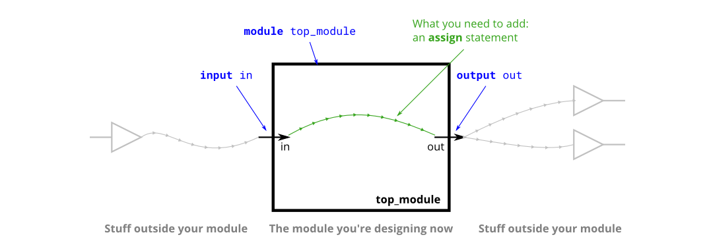  

> 除了连续赋值之外，Verilog还有另外三种用于程序块(Procedural block)的赋值类型,其中两种是可综合的.在开始使用Procedural block之前，我们不会使用它们。

- Module Declaraction
```verilog
module top_module( input in, output out );
```

- Solution
```verilog
module top_module( input in, output out );
    assign out = in;
endmodule
```

#### - Four wires  

&emsp;&emsp;创建一个具有3个输入和4个输出的模块,这些输入和输出的行为如下:
```
A ->W
B -> X
B -> Y
C -> Z
```
&emsp;&emsp;下图说明了电路的每个部分如何对应Verilog代码的每个部分.模块外部有三个输入端口和四个输出端口.  

&emsp;&emsp;当您有多个assign语句时,它们在代码中的出现顺序并不重要.与编程语言不同,assign语句("连续赋值")描述事物之间的连接,而不是将值从一个事物复制到另一个事物的操作.  

&emsp;&emsp;可能现在应该澄清的一个潜在的困惑来源是:这里的绿色箭头表示电线之间的连接,但不是wire本身.模块本身已经声明了7条线(名为A、B、C、W、X、Y和Z).这是因为input与output被声明为了wire类型.因此,assign语句不会创建wire,而是描述了在已存在的7条线之间创建的连接.

  

- Module Declaraction  
```verilog
module top_module(
	input a,b,c;
	output w,x,y,z
);
```

- Solution
```verilog
module top_module( 
    input a,b,c,
    output w,x,y,z );
    assign w=a;
    
assign x=b;
    
assign y=b;
    
assign z=c;
endmodule
```

#### - 反转器 (Inveter)  

&emsp;&emsp;创建实现非门的模块.  

&emsp;&emsp;这个电路和电线相似,但有点不同.当把电线从进线连接到出线时,我们要实现一个反相器(非门)，而不是一根普通的线.  

&emsp;&emsp;使用assign语句.assign语句将连续地将in取反并输出.  


- Module
```verilog
module top_module( input in, output out );
```

- Solution
```verilog
module top_module( input in, output out );
	assign out = !in;
endmodule
```

#### - 与门 (AND gate)  

&emsp;&emsp;创建实现和门的模块.  

&emsp;&emsp;这个电路现在有三条线(A、B和OUT).导线A和B已经具有由输入端口驱动的值.但目前的布线并不是由任何东西驱动的.写一个赋值语句,用信号A和B的和来驱动.  

&emsp;&emsp;输入线由模块外部的东西驱动.assign语句将把一个逻辑级别驱动信号连接到一条线上.正如您可能期望的那样,一条线不能有多个驱动信号(如果有的话,它的逻辑级别是什么?),并且没有驱动信号的导线将具有未定义的值(在合成硬件时通常被视为0,但有时候会出现奇怪的错误).  

  

- Module Declaraction
```verilog
module top_module( 
    input a, 
    input b, 
    output out );
```

- Solution
```verilog
module top_module( 
    input a, 
    input b, 
    output out );
assign out = a&b;
endmodule
```

#### - 或非门 (NOR gate)  

&emsp;&emsp;创建实现或非门的模块.或非门是一个输出反转的或门.

&emsp;&emsp;assign语句用一个值来驱动(drive)一条线(或者更正式地称为"net").这个值可以是任意复杂的函数,只要它是一个组合逻辑(即,无内存(memory-less),无隐藏状态).  

  

- Module Declaraction 
```verilog
module top_module( 
    input a, 
    input b, 
    output out );
```

- Solution
```verilog
module top_module( 
    input a, 
    input b, 
    output out );
    assign out = !(a|b);
endmodule
```

#### - 异或非门 (XNOR gate)  
&emsp;&emsp;实现异或非门模块.


- Module Declaraction 
```verilog
module top_module( 
    input a, 
    input b, 
    output out );
```

- Solution
```verilog
module top_module( 
    input a, 
    input b, 
    output out );
    assign out = !(a^b);
endmodule
```


#### - 声明wires  

&emsp;&emsp;到目前为止,电路都十分简单.随着电路变得越来越复杂,您将需要wire将内部组件连接在一起.当您需要使用导线时,您应该在模块体中在首次使用之前的某个地方声明它.(将来,您将遇到更多类型的信号和变量,它们也以相同的方式声明,但现在,我们将从Wire类型的信号开始).

  

```verilog
module top_module (
    input in,              // Declare an input wire named "in"
    output out             // Declare an output wire named "out"
);

    wire not_in;           // Declare a wire named "not_in"

    assign out = ~not_in;  // Assign a value to out (create a NOT gate).
    assign not_in = ~in;   // Assign a value to not_in (create another NOT gate).

endmodule   // End of module "top_module"
```
&emsp;&emsp;实现以下电路.创建两个wire(命名任意)以将and/or gate连接在一起.请注意,Not gate 是输出,因此您不必在这里声明第三条线.wire可有多个输出,但只能有一个输入驱动.  

&emsp;&emsp;如果您遵循图中的电路结构,那么应该以四个赋值语句结束,因为有四个信号需要赋值.  

  


- Module Declaraction 
```verilog
`default_nettype none
module top_module(
    input a,
    input b,
    input c,
    input d,
    output out,
    output out_n   ); 
```

- Solution
```verilog
`default_nettype none
module top_module(
    input a,
    input b,
    input c,
    input d,
    output out,
    output out_n   ); 
wire inside1,inside2;
    
assign inside1 = a&b;
    
assign inside2 = c&d; 
    
assign out = inside1|inside2;
    
    assign out_n = !(out);
endmodule
```


#### - 7458模块

&emsp;&emsp;实现如下电路:  

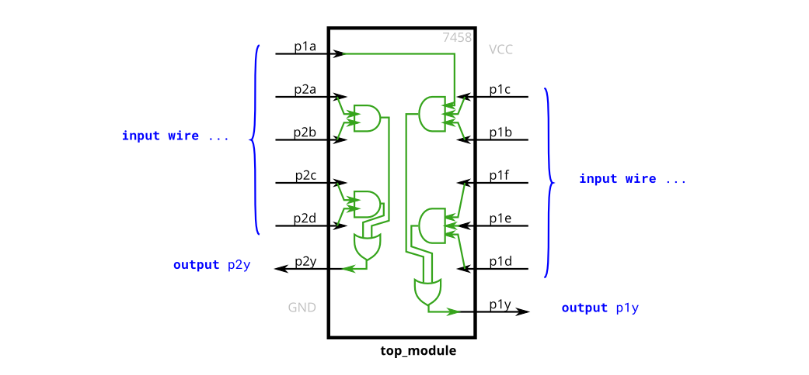  

- Module Declaraction 
```verilog
module top_module ( 
    input p1a, p1b, p1c, p1d, p1e, p1f,
    output p1y,
    input p2a, p2b, p2c, p2d,
    output p2y );
```

- Solution
```verilog
module top_module ( 
    input p1a, p1b, p1c, p1d, p1e, p1f,
    output p1y,
    input p2a, p2b, p2c, p2d,
    output p2y );
wire inside1,inside2,inside3,inside4;
    
assign inside1 = p1a&p1b&p1c;
    
assign inside2 = p1d&p1e&p1f;
    
assign inside3 = p2a&p2b;
    
assign inside4 = p2c&p2d;
    
assign p1y = inside1|inside2;
    
assign p2y = inside3|inside4;

endmodule
```

---

### 容器(Vectors)  

#### - 容器介绍

&emsp;&emsp;vector被用来对相关的信号进行分组,以便于操作.例如,`Wire[7:0]w`;声明一个名为w 的 8 位数组,在功能上相当于具有8条独立的线.  

&emsp;&emsp;请注意，vector的声明将维度(dimensions 即数组长度)放在容器名称之前,这与C语法相比不常见.  

> 至于为什么会是如下声明,主要是采用了小端序.

```verilog
Wire[99:0]my_vector；//声明一个长度为100容器
assign out=my_vector[10]；//从数组中选择一位
```

&emsp;&emsp;构建一个具有一个3位vector输入的电路,并将其拆分为三个单独的1位输出.  

  

- Module Declaraction 
```verilog
module top_module ( 
    input wire [2:0] vec,
    output wire [2:0] outv,
    output wire o2,
    output wire o1,
    output wire o0  ); 
```

- Solution
```verilog
module top_module ( 
    input wire [2:0] vec,
    output wire [2:0] outv,
    output wire o2,
    output wire o1,
    output wire o0  ); // Module body starts after module declaration
    assign o0 = vec[0];
    
    assign o1 = vec[1];
    
    assign o2 = vec[2];
    
assign outv = vec;
endmodule
```

#### - 容器细节

&emsp;&emsp;vector声明如下:  

> type [upper:lower] vector_name;
> `type`指定了vector的类型,通常是`wire`或者`reg`.

```verilog
wire [2:0] a, c;   // Two vectors
assign a = 3'b101;  // a = 101
assign b = a;       // b =   1  implicitly-created wire
assign c = b;       // c = 001  <-- bug
my_module i1 (d,e); // d and e are implicitly one-bit wide if not declared.
                    // This could be a bug if the port was intended to be a vector.
```

- 关于"片选"(Part Selection) 
&emsp;&emsp;访问整个数组只需要:  
```verilog
assign w = a;
```
&emsp;&emsp;而访问数组的一部分,若长度在赋值时不匹配,则用0补齐例如:
```verilog
reg [7:0] c;
assign c = x[3:1];
//此时,长度不匹配,则用0补齐

w[3:0]      // Only the lower 4 bits of w
x[1]        // The lowest bit of x
x[1:1]      // ...also the lowest bit of x
z[-1:-2]    // Two lowest bits of z
b[3:0]      // Illegal. Vector part-select must match the direction of the declaration.
b[0:3]      // The *upper* 4 bits of b.
assign w[3:0] = b[0:3];    // Assign upper 4 bits of b to lower 4 bits of w. w[3]=b[0], w[2]=b[1], etc.
```

&emsp;&emsp;建立一个电路,将一个半字(16 bits,[15:0])分成高8位[15:8],与低8位[7:0]输出.


- Module Declaraction 
```verilog
`default_nettype none     // Disable implicit nets. Reduces some types of bugs.
module top_module( 
    input wire [15:0] in,
    output wire [7:0] out_hi,
    output wire [7:0] out_lo );
```

- Solution
```verilog
`default_nettype none     // Disable implicit nets. Reduces some types of bugs.
module top_module( 
    input wire [15:0] in,
    output wire [7:0] out_hi,
    output wire [7:0] out_lo );
    assign out_lo = in[7:0];
    
    assign out_hi = in[15:8];
endmodule
```

#### - 容器的片选(Vector part select)  

&emsp;&emsp;32位矢量可以被视为包含4个字节（位[31:24]、[23:16]等）。建立一个电路，使4字节字颠倒顺序。
```
aaaaaaaabbbbbbcccccccccddddddd=>ddddddddccccccccccbbbbbbbaaaaaaaa
```
&emsp;&emsp;此操作通常在需要交换一段数据的结束地址时使用，例如在Little Endian(小端序) x86系统和许多Internet协议中使用的Big Endian(大端序格式之间。

- Module Declaraction 
```verilog
module top_module( 
    input [31:0] in,
    output [31:0] out );
```

- Solution
```verilog
module top_module( 
    input [31:0] in,
    output [31:0] out );//

    // assign out[31:24] = ...;
    assign out[31:24] = in[7:0];
    
    assign out[23:16] = in[15:8];
    
    assign out[15:8] = in[23:16];
    
    assign out[7:0] = in[31:24];
endmodule
```

#### - 位级操作(Bitwise operators)  

&emsp;&emsp;建立一个电路,该电路有两个3-bits输入,用于计算两个vector的"基于位"的或(bitwise-OR)、两个矢量的"逻辑或"(Logical-OR)和两个矢量的非(NOT).将b的非放在out-not的高位部分(即[5:3]),将a的非放在低位部分。

&emsp;&emsp;看看模拟波形,看看bitwise-OR与Logical-OR的区别.


- Module Declaraction 
```verilog
module top_module( 
    input [2:0] a,
    input [2:0] b,
    output [2:0] out_or_bitwise,
    output out_or_logical,
    output [5:0] out_not
);
```

- Solution
```verilog
module top_module(
	input [2:0] a, 
	input [2:0] b, 
	output [2:0] out_or_bitwise,
	output out_or_logical,
	output [5:0] out_not
);
	
	assign out_or_bitwise = a | b;
	assign out_or_logical = a || b;

	assign out_not[2:0] = ~a;	// Part-select on left side is o.
	assign out_not[5:3] = ~b;	//Assigning to [5:3] does not conflict with [2:0]
	
endmodule
```

#### - 4位Vecotr  

&emsp;&emsp;建立一个具有4为输入的组合电路,输出要求如下:  

- `out_and`: 输入经过 "与门" 后的结果
- `out_or`: 输入经过 "或门" 后的结果
- `out_xor`: 输入经过 "异或门" 后的结果


- Module Declaraction 
```verilog
module top_module( 
    input [3:0] in,
    output out_and,
    output out_or,
    output out_xor
);
```

- Solution
```verilog
module top_module( 
    input [3:0] in,
    output out_and,
    output out_or,
    output out_xor
);
    assign out_and = in[0]&in[1]&in[2]&in[3];
    
    assign out_or = in[0]|in[1]|in[2]|in[3];
    
    assign out_xor = in[0]^in[1]^in[2]^in[3];
endmodule

```

#### - Vector连接操作符(Vector concatenation operator)  

&emsp;&emsp;片选用于选择vector的部分.连接运算符{a,b,c}用于通过将vector的较小部分连接在一起来创建较大的vector.
```verilog
{3'b111, 3'b000} => 6'b111000
{1'b1, 1'b0, 3'b101} => 5'b10101
{4'ha, 4'd10} => 8'b10101010     // 4'ha and 4'd10 are both 4'b1010 in binary
```
&emsp;&emsp;连接需要知道每个组件的宽度,因此,{1,2,3}是非法的,并导致错误消息：串联中不允许使用未经大小化的常量。
连接操作符可以在赋值的左侧和右侧使用。
```verilog
input [15:0] in;
output [23:0] out;
assign {out[7:0], out[15:8]} = in;         // Swap two bytes. Right side and left side are both 16-bit vectors.
assign out[15:0] = {in[7:0], in[15:8]};    // This is the same thing.
assign out = {in[7:0], in[15:8]};       // This is different. The 16-bit vector on the right is extended to
                                        // match the 24-bit vector on the left, so out[23:16] are zero.
                                        // In the first two examples, out[23:16] are not assigned.

```
&emsp;&emsp;连接并重新分割给定输入:

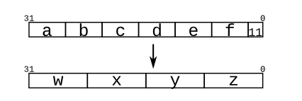


- Module Declaraction 
```verilog
module top_module (
    input [4:0] a, b, c, d, e, f,
    output [7:0] w, x, y, z );
```

- Solution
```verilog
module top_module (
    input [4:0] a, b, c, d, e, f,
    output [7:0] w, x, y, z );//

    // assign { ... } = { ... };
    assign {w[7:0],x[7:0],y[7:0],z[7:0]} = {a[4:0],b[4:0],c[4:0],d[4:0],e[4:0],f[4:0],2'b11};
endmodule
```

#### - 反转Vector  

&emsp;&emsp;反转一个8位vector

- Module Declaraction 
```verilog
module top_module( 
    input [7:0] in,
    output [7:0] out
);
```

- Solution
```verilog
module top_module( 
    input [7:0] in,
    output [7:0] out
);
    assign {out[0],out[1],out[2],out[3],out[4],out[5],out[6],out[7]} = in;
endmodule
```

#### - 拷贝操作符(Replication operator)  

&emsp;&emsp;连接运算符允许将vector连接在一起以形成较大的vector.但是有时候你想把同一个东西连接在一起很多次,比如`assign A = {B, B, B, B, B, B};`这样的事情仍然很乏味.复制运算符允许复制vector并将它们连接在一起:
```verilog
{num{vector}}
```
&emsp;&emsp;这会将`vector`复制`num`次.

例如:
```verilog
{5{1'b1}}           // 5'b11111 (or 5'd31 or 5'h1f)
{2{a,b,c}}          // The same as {a,b,c,a,b,c}
{3'd5, {2{3'd6}}}   // 9'b101_110_110. It's a concatenation of 101 with
                    // the second vector, which is two copies of 3'b110.
```

&emsp;&emsp;复制运算经常会用在"有符号数"的扩转运算中,假如将一个8位有符号数扩展到16位,我们需要将其符号位进行复制并填充到扩展位.即:
```
8'b10000001 => 16'b1111111110000001
//这就是有符号数的扩展
```

- Module Declaraction 
```verilog
module top_module (
    input [7:0] in,
    output [31:0] out );
```

- Solution
```verilog
module top_module (
    input [7:0] in,
    output [31:0] out );//

    // assign out = { replicate-sign-bit , the-input };
    assign out[31:0] = {{24{in[7]}},in[7:0]};
endmodule
```

#### - 拷贝练习  

&emsp;&emsp;给定5个1位的输入信号,并进行如下图的比较运算,相同的位记为1,并储存在out中.  

```verilog
out[24] = ~a ^ a;   // a == a, so out[24] is always 1.
out[23] = ~a ^ b;
out[22] = ~a ^ c;
...
out[ 1] = ~e ^ d;
out[ 0] = ~e ^ e;
```

  

- Module Declaraction 
```verilog
module top_module (
    input a, b, c, d, e,
    output [24:0] out );
```

- Solution
```verilog
module top_module (
    input a, b, c, d, e,
    output [24:0] out );//

    // The output is XNOR of two vectors created by 
    // concatenating and replicating the five inputs.
    // assign out = ~{ ... } ^ { ... };
    assign out =  ~{{5{a}},{5{b}},{5{c}},{5{d}},{5{e}}} ^ {5{a,b,c,d,e}};
endmodule
```

---

### 模块与层级(Modules: Hierarchy)  

#### - 模块  


&emsp;&emsp;现在你已经对module很熟悉了,模块实际上就是封装起来的电路.下图显示了一个带有子模块的非常简单的电路.在本练习中,创建模块mod_a的一个实例,然后将模块的三个插脚(in1、in2和out)连接到顶级模块的三个端口(wire a、b和out).模块mod_a是为您提供的,您必须实例化它。

  	

> 你有两种实例化模块的方式  
>
> 1. 通过位置:
```verilog
mod_a ins1 (wa, wb, wc);
```
> 2. 通过名称:
```verilog
mod_a ins2 ( .out(wc), .in1(wa), .in2(wb) )
```


- Module Declaraction 
```verilog
module top_module ( input a, input b, output out );
```

- Solution
```verilog
module top_module ( input a, input b, output out );
    mod_a ins(a,b,out);
endmodule
```

#### - 按位置连接端口(Connecting ports by position)  

&emsp;&emsp;此问题与前一个问题（模块）类似。您将得到一个名为mod_a的模块，该模块按顺序具有2个输出和4个输入。您必须按位置将6个端口连接到顶级模块的端口out1、out2、A、B、C和D，顺序如下。
您将获得以下模块：

`module mod_a ( output, output, input, input, input, input );`


- Module Declaraction 
```verilog
module top_module ( 
    input a, 
    input b, 
    input c,
    input d,
    output out1,
    output out2
);
```

- Solution
```verilog
module top_module ( 
    input a, 
    input b, 
    input c,
    input d,
    output out1,
    output out2
);
    mod_a ins(out1,out2,a,b,c,d);
endmodule
```

#### - 按名称连接端口(Connecting ports by name)  

&emsp;&emsp;您将得到一个名为mod_a的模块,该模块具有2个输出和4个输入.必须按名称将6个端口连接到顶级模块的端口:

|Port in mod_a|Port in top_module|
|:--:|:--:|
|output out1|out1|
|output out2|out2|
|input in1|a|
|input in2|b|
|input in3|c|
|input in4|d|

> mod_a接口如下:
`module mod_a ( output out1, output out2, input in1, input in2, input in3, input in4);`

  


- Module Declaraction 
```verilog
module top_module ( 
    input a, 
    input b, 
    input c,
    input d,
    output out1,
    output out2
);
```

- Solution
```verilog
module top_module ( 
    input a, 
    input b, 
    input c,
    input d,
    output out1,
    output out2
);
    mod_a ins(.out1(out1), .out2(out2), .in1(a), .in2(b), .in3(c), .in4(d));
endmodule
```

#### - 三个模块  

&emsp;&emsp;我们为您提供了一个my_df模块,具有一个输入和一个输出(实现D触发器).实例化其中的三个,然后将它们链接在一起,形成长度为3的移位寄存器.CLK端口需要连接到所有实例.


- Module Declaraction 
```verilog
module top_module ( input clk, input d, output q );
```

- Solution
```verilog
module top_module ( input clk, input d, output q );
    
wire out1,out2;
    my_dff ins1(clk,d,out1);
    
    my_dff ins2(clk,out1,out2);
    
    my_dff ins3(clk,out2,q);
endmodule
```

#### - 模块与容器  

&emsp;&emsp;我们为您提供了一个模块my-dff8,它有两个输入和一个输出(实现一组8 D-触发器)。实例化其中三个,然后将它们链接在一起,形成长度为3的8位宽移位寄存器.此外,创建一个4对1多路选择器,根据sel[1:0]选择输出内容.


- Module Declaraction 
```verilog
module top_module ( 
    input clk, 
    input [7:0] d, 
    input [1:0] sel, 
    output [7:0] q 
);
```

- Solution
```verilog
module top_module ( 
    input clk, 
    input [7:0] d, 
    input [1:0] sel, 
    output [7:0] q 
);
    wire [7:0] out1, out2, out3;
    my_dff8 ins1(clk,d,out1);
    my_dff8 ins2(clk,out1,out2);
    my_dff8 ins3(clk,out2,out3);
    always @(*) begin
        case(sel)
            
2'b00:begin
    
q = d;
    
end
            2'b01:begin
                q[7:0] = out1[7:0];
            end
            2'b10:begin
                q[7:0] = out2[7:0];
            end
            2'b11:begin
                q[7:0] = out3[7:0];
            end
        endcase
    end
endmodule
```

#### - 加法器1  

&emsp;&emsp;为你提供了add16模块,这是一个16位加法器,请实例化两个该模块并实现如下图32为加法器,请考虑进位.


- Module Declaraction 
```verilog
module top_module(
    input [31:0] a,
    input [31:0] b,
    output [31:0] sum
);
```

- Solution
```verilog
module top_module(
    input [31:0] a,
    input [31:0] b,
    output [31:0] sum
);
    wire [15:0] sum1, sum2;
    wire cin, cout, cout1;
    add16 ins1(a[15:0], b[15:0], 0, sum1, cout);
    add16 ins2(a[31:16], b[31:16], cout, sum2, cout1);
    assign sum = {sum2,sum1};
endmodule
```

#### - 加法器2

&emsp;&emsp;请封装一个名为add1的16位加法器模块,并用其实现一个32位加法器.

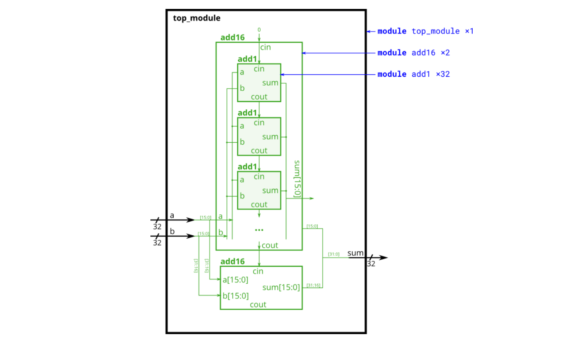


- Module Declaraction 
```verilog
module top_module (
    input [31:0] a,
    input [31:0] b,
    output [31:0] sum
);//

endmodule

module add1 ( input a, input b, input cin,   output sum, output cout );

// Full adder module here

endmodule
```

- Solution
```verilog
module top_module (
    input [31:0] a,
    input [31:0] b,
    output [31:0] sum
);//
    wire cout,cout1;
    wire [15:0] sum1, sum2;
    add16 ins1(a[15:0],b[15:0],0,sum1,cout);
    add16 ins2(a[31:16],b[31:16],cout,sum2,cout1);
    assign sum = {sum2[15:0],sum1[15:0]};

endmodule

module add1 ( input a, input b, input cin,   output sum, output cout );

// Full adder module here
    assign {cout,sum} = a+b+cin;
endmodule
```

#### - 进位选择加法器  

&emsp;&emsp;已为您提供了16位加法器add16模块,请实现如下图电路模块,即考虑第16位相加的进位.  


- Module Declaraction 
```verilog
module top_module(
    input [31:0] a,
    input [31:0] b,
    output [31:0] sum
);
```

- Solution
```verilog
module top_module(
    input [31:0] a,
    input [31:0] b,
    output [31:0] sum
);
    wire [15:0] sum1,sum2,sum3;
    wire cout,cout1;
    add16 ins1(a[15:0], b[15:0], 0, sum1, cout);
    add16 ins2(a[31:16], b[31:16], 0, sum2, cout1);
    add16 ins3(a[31:16], b[31:16], 1, sum3, cout1);
    always @(*) begin
        case (cout)
            1'b0:begin 
                sum[31:0] = {sum2[15:0],sum1[15:0]};
            end
            1'b1:begin
                sum = {sum3,sum1};
            end
        endcase
    end
endmodule
```

#### - 加-减法器(Adder-subtractor)

&emsp;&emsp;已为你提供了16位加法器add16模块,请实现如下图加法-减法器,通过一个32位"异或门"来决定加法或减法.  


- Module Declaraction 
```verilog
module top_module(
    input [31:0] a,
    input [31:0] b,
    input sub,
    output [31:0] result
);
```

- Solution
```verilog
module top_module(
    input [31:0] a,
    input [31:0] b,
    input sub,
    output [31:0] result
);
    
    wire [31:0]invert;
    wire [15:0]sum1,sum2;
    wire cout,cout1;
    assign invert[31:0] = b[31:0]^{32{sub}};
    add16 ins1(a[15:0], invert[15:0], sub, sum1, cout);
    add16 ins2(a[31:16], invert[31:16], cout, sum2, cout1);
    assign result = {sum2,sum1};
endmodule
```

---

### 过程(Procedures)  

#### - Always块 -- 组合逻辑 (Always blocks -- Combinational)  

&emsp;&emsp;由于数字电路是由与电线相连的逻辑门组成的，所以任何电路都可以表示为模块和赋值语句的某种组合.然而，有时这不是描述电路最方便的方法.

&emsp;&emsp;两种always block是十分有用的:  

- 组合逻辑: `always @(*)`
- 时序逻辑: `always @(posedge clk)`

&emsp;&emsp;`always @(*)`就相当于赋值语句--assign,因此选择哪一种语法仅仅取决与方便程度.block内还有更丰富的语句集,比如if-else,case等等.但不能包含连续赋值,即不可包含assign,因为他与always @(*)冲突.  
> 以下语句是等价的
```verilog
assign out1 = a & b | c ^ d;
always @(*) out2 = a & b | c ^ d;
```


- Module Declaraction 
```verilog
module top_module(
    input a, 
    input b,
    output wire out_assign,
    output reg out_alwaysblock
);
```

- Solution
```verilog
// synthesis verilog_input_version verilog_2001
module top_module(
    input a, 
    input b,
    output wire out_assign,
    output reg out_alwaysblock
);
	assign out_assign = a&b;
    
    always @(*) out_alwaysblock = a&b;
endmodule
```

#### - Always块 -- 时序逻辑 (Always blocks -- Clocked)  

&emsp;&emsp;verilog中有三种赋值方式:

- 连续赋值: `assign x = y;` 不能在always-block内使用
- 阻塞赋值: `x = y;`,只能在always-block内使用 
- 非阻塞赋值: `x <= y`,只能在always-block内使用

> 请在组合逻辑中使用阻塞赋值,在时序逻辑中使用非阻塞赋值
> 否则将产生难以发现的错误

&emsp;&emsp;请实现如下电路:

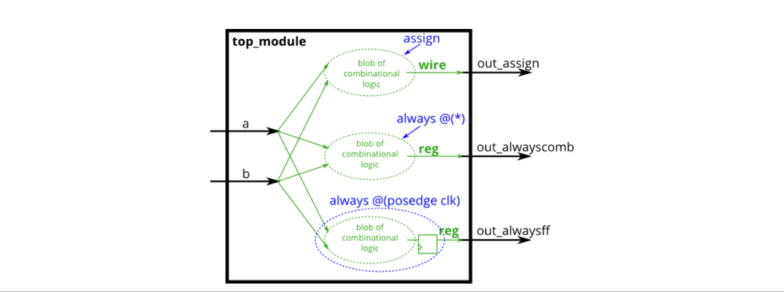

- Module Declaraction 
```verilog
module top_module(
    input clk,
    input a,
    input b,
    output wire out_assign,
    output reg out_always_comb,
    output reg out_always_ff   );
```

- Solution
```verilog
// synthesis verilog_input_version verilog_2001
module top_module(
    input clk,
    input a,
    input b,
    output wire out_assign,
    output reg out_always_comb,
    output reg out_always_ff   );
assign out_assign = a^b;
    
    always @(*) out_always_comb = a^b;
    
    always @(posedge clk) out_always_ff <= a^b;
endmodule
```

#### - If语句  

&emsp;&emsp;if语句通常创建一个2对1的多路选择器，如果条件为真，则选择一个输入，如果条件为假，则选择另一个输入。一下两种写法是等价的:
```verilog
always @(*) begin
    if (condition) begin
        out = x;
    end
    else begin
        out = y;
    end
end

assign out = (condition) ? x : y;
```
&emsp;&emsp;建立一个在a和b之间选择的2对1多路选择器。如果sel_b1和sel_b2都为真，则选择b。否则，选择a。执行相同的操作两次，一次使用assign语句，一次使用if语句。  


- Module Declaraction 
```verilog
module top_module(
    input a,
    input b,
    input sel_b1,
    input sel_b2,
    output wire out_assign,
    output reg out_always   ); 
```

- Solution
```verilog
// synthesis verilog_input_version verilog_2001
module top_module(
    input a,
    input b,
    input sel_b1,
    input sel_b2,
    output wire out_assign,
    output reg out_always   ); 
    assign out_assign = (sel_b1&sel_b2)?b:a;
    
    always @(*) begin
        if(sel_b1&sel_b2) begin
            out_always = b;
        end
        else begin
            out_always = a;
        end
    end
endmodule
```

#### - If语句引发的锁存(latches)  

&emsp;&emsp;以下代码包含锁存的错误行为。修正这些错误，这样你只有在电脑过热的时候才会关掉它，你到达目的地或者需要加油的话就停止驾驶。

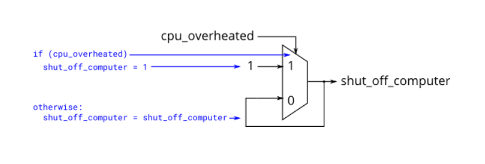

- Module Declaraction 
```verilog
always @(*) begin
    if (cpu_overheated)
       shut_off_computer = 1;
end

always @(*) begin
    if (~arrived)
       keep_driving = ~gas_tank_empty;
end
```

- Solution
```verilog
// synthesis verilog_input_version verilog_2001
module top_module (
    input      cpu_overheated,
    output reg shut_off_computer,
    input      arrived,
    input      gas_tank_empty,
    output reg keep_driving  ); //

    always @(*) begin
        if (cpu_overheated) begin
            shut_off_computer = 1;
        end
        else begin
            shut_off_computer = 0;
        end
    end
    
    always @(*) begin
        if (~arrived&~gas_tank_empty) begin
            keep_driving = ~gas_tank_empty&(~arrived);
       end
       else begin
           keep_driving = ~(gas_tank_empty|arrived);
       end
    end

endmodule
```

#### - Case语句  

&emsp;&emsp;verilog中的case语句几乎等同于if elseif else的序列，该序列将一个表达式与其他表达式列表进行比较。它的语法和功能与C语言中的switch语句不同。
```verilog
always @(*) begin     // This is a combinational circuit
    case (in)
      1'b1: begin 
               out = 1'b1;  // begin-end if >1 statement
            end
      1'b0: out = 1'b0;
      default: out = 1'bx;
    endcase
end
```

- case语句以case开头,每个"case item"以冒号结尾,没有switch
- 每个case项只能执行一条语句。这使得C中使用的“break”不必要.但这意味着如果需要多个语句,必须使用begin…end  

&emsp;&emsp;如果有大量选项的情况，case语句比if语句更方便。因此，在本练习中，创建一个6对1的多路选择器.当sel介于0和5之间时，选择相应的数据输入,否则，输出0.数据输入和输出均为4位宽.小心锁存.

- Module Declaraction 
```verilog
module top_module ( 
    input [2:0] sel, 
    input [3:0] data0,
    input [3:0] data1,
    input [3:0] data2,
    input [3:0] data3,
    input [3:0] data4,
    input [3:0] data5,
    output reg [3:0] out   );
```

- Solution
```verilog
// synthesis verilog_input_version verilog_2001
module top_module ( 
    input [2:0] sel, 
    input [3:0] data0,
    input [3:0] data1,
    input [3:0] data2,
    input [3:0] data3,
    input [3:0] data4,
    input [3:0] data5,
    output reg [3:0] out   );//

    always@(*) begin  // This is a combinational circuit
        case(sel)
            3'b0: begin
                out = data0;
            end
            3'b001: begin
                out = data1;
            end
            3'b010: begin
                out = data2;
            end
            3'b011: begin
                out = data3;
            end
            3'b100: begin
                out = data4;
            end
            3'b101: begin
                out = data5;
            end
            default: begin
                out[3:0] = 0;
            end
        endcase
    end

endmodule
```

#### - 简单编码器1  

&emsp;&emsp;priority encoder是一种组合电路,当输入一个vector时,输出第一个'1'出现的位置.例如:输入8'b10010000,输出3'd4,因为[4]是第一个高位.
&emsp;&emsp;构建一个4位encoder,若全是低位则输出0.

- Module Declaraction 
```verilog
module top_module (
    input [3:0] in,
    output reg [1:0] pos  );
```

- Solution
```verilog
// synthesis verilog_input_version verilog_2001
module top_module (
    input [3:0] in,
    output reg [1:0] pos  );
    always @(*) begin
        if (in[0] == 1'b1) begin
                pos = 2'd0;
        end
        else begin
            if(in[1] == 1'b1) begin
                pos = 2'd1;
            end
            else begin
                if(in[2] == 1'b1) begin
                    pos = 2'd2;
                end
                else begin
                    if(in[3] == 1'b1) begin
                        pos = 2'd3;
                    end
                    else begin
                        pos = 0;
                    end
                end
            end
        end
    end
endmodule
```

#### - 简单编码器2  

&emsp;&emsp;假如现在输入是8位,那么就会有256种情况,我们可以使用casez来将item减少到9种.  
例如:
```verilog
always @(*) begin
    casez (in[3:0])
        4'bzzz1: out = 0;   // in[3:1] can be anything
        4'bzz1z: out = 1;
        4'bz1zz: out = 2;
        4'b1zzz: out = 3;
        default: out = 0;
    endcase
end
```

- Module Declaraction 
```verilog
module top_module (
    input [7:0] in,
    output reg [2:0] pos  );
```

- Solution
```verilog
// synthesis verilog_input_version verilog_2001
module top_module (
    input [7:0] in,
    output reg [2:0] pos  );
always @(*) begin
    casez (in[7:0])
        8'bzzzzzzz1: begin
            pos = 3'd0;
        end
        8'bzzzzzz1z: begin
            pos = 3'd1;
        end
        8'bzzzzz1zz: begin
            pos = 3'd2;
        end
        8'bzzzz1zzz: begin
            pos = 3'd3;
        end
        8'bzzz1zzzz: begin
            pos = 3'd4;
        end
        8'bzz1zzzzz: begin
            pos = 3'd5;
        end
        8'bz1zzzzzz: begin
            pos = 3'd6;
        end
        8'b1zzzzzzz: begin
            pos = 3'd7;
        end
        default: begin
            pos = 0;
        end
    endcase
end
endmodule
```

#### - 避免锁存

&emsp;&emsp;假设您正在构建一个电路来处理游戏中PS/2键盘的扫描代码。接收到的最后两个字节的扫描代码，您需要判断是否已按下键盘上的一个箭头键。这涉及到一个相当简单的映射，它可以使用一个case语句（或者如果elseif）实现，有四个case。

|Scancode [15:0]|Arrow key|
|:--:|:--:|
|16'he06b|left arrow|
|16'he072|down arrow|
|16'he074|right arrow|
|16'he075|up arrow|
|Anything|else	none|

&emsp;&emsp;为了避免创建锁存，必须在所有可能的条件下为所有输出分配一个值

- Module Declaraction 
```verilog
module top_module (
    input [15:0] scancode,
    output reg left,
    output reg down,
    output reg right,
    output reg up  ); 
```

- Solution
```verilog
// synthesis verilog_input_version verilog_2001
module top_module (
    input [15:0] scancode,
    output reg left,
    output reg down,
    output reg right,
    output reg up  ); 
    always @(*) begin
        left = 0;
        down = 0;
        left = 0;
        right = 0;
        case (scancode)
            16'he06b: begin
                left = 1;
            end
            16'he072: begin
                down = 1;
            end
            16'he074: begin
                right = 1;
            end
            16'he075: begin
                up = 1;
            end
            default: begin
                up = 0;
                down = 0;
                left = 0;
                right = 0;
            end
        endcase
    end
endmodule
```

---

### 更多语法特点  

&emsp;&emsp;verilog也有像C一样的三目算符:  
```verilog
condition ? true : false;
```

&emsp;&emsp;给定四个无符号数，求其最小值。

- Module Declaraction 
```verilog
module top_module (
    input [7:0] a, b, c, d,
    output [7:0] min);
```

- Solution
```verilog

```

#### - 三目算符 

&emsp;&emsp;verilog也有像C一样的三目算符:  
```verilog
condition ? true : false;
```

&emsp;&emsp;给定四个无符号数，求其最小值。

- Module Declaraction 
```verilog
module top_module (
    input [7:0] a, b, c, d,
    output [7:0] min);
```

- Solution
```verilog
module top_module (
    input [7:0] a, b, c, d,
    output [7:0] min);//

    // assign intermediate_result1 = compare? true: false;
	
    wire [7:0]min1,min2;
    assign min1=(a<b?a:b);
    
    assign min2 = (min1<c?min1:c);
    
    assign min = (min2<d?min2:d);
endmodule

```

#### - 优化运算1  

&emsp;&emsp;奇偶校验经常被用来作为一种简单的方法检测错误。创建一个电路，该电路将为一个8位字节计算一个奇偶校验位.

> 即计算输入8个位的异或

- Module Declaraction 
```verilog
module top_module (
    input [7:0] in,
    output parity); 
```

- Solution
```verilog
module top_module (
    input [7:0] in,
    output parity); 
    assign parity = ^in[7:0];
endmodule
```

#### - 优化运算2  

&emsp;&emsp;建立如下电路:  

- `out_and`: 对输入数据求与  
- `out_or`: 对输入数据求或  
- `out_xor`:对输入数据求异或  

- Module Declaraction 
```verilog
module top_module( 
    input [99:0] in,
    output out_and,
    output out_or,
    output out_xor 
);
```

- Solution
```verilog
module top_module( 
    input [99:0] in,
    output out_and,
    output out_or,
    output out_xor 
);
    assign out_and = &in[99:0];
    assign out_or = |in[99:0];
    assign out_xor = ^in[99:0];
endmodule
```

#### - 循环 -- 组合逻辑:实现Vector反转  

&emsp;&emsp;反转vector顺序

- Module Declaraction 
```verilog
module top_module( 
    input [99:0] in,
    output [99:0] out
);
```

- Solution
```verilog
module top_module( 
    input [99:0] in,
    output [99:0] out
);
    integer i;
    always @(*) begin
        for(i=0;i<=99;i=i+1)
            out[7'd99-i] <= in[i];
    end
endmodule
```

#### - 循环 -- 组合逻辑:实现255位计数器  

&emsp;&emsp;计算vector中1的个数

- Module Declaraction 
```verilog
module top_module( 
    input [254:0] in,
    output [7:0] out );
```

- Solution
```verilog
module top_module( 
    input [254:0] in,
    output [7:0] out );
    integer i;
    reg [7:0]count;
    always @(*) begin
        
	count=0;
        for(i=0;i<=254;i=i+1) begin
            if(in[i] == 1) begin
                count = count + 7'b1;
            end
        end
    end
    assign out = count;
endmodule
```

#### - 循环:实现100位加法器  

&emsp;&emsp;通过实例化100个全加器构建一个100位加法器.

- Module Declaraction 
```verilog
module top_module( 
    input [99:0] a, b,
    input cin,
    output [99:0] cout,
    output [99:0] sum );
```

- Solution
```verilog
module top_module( 
    input [99:0] a, b,
    input cin,
    output [99:0] cout,
    output [99:0] sum );
    reg [100:0]cin1;

    generate
    genvar i;
    for(i=0;i<100;i=i+1) begin:adds
        
        if(i==0) begin        
		    add ins(a[i],b[i],cin,sum[i],cout[i]);            
            assign cin1[i+1]=cout[i];
        end            
        else begin
            add ins(a[i],b[i],cin1[i],sum[i],cout[i]);
            assign cin1[i+1]=cout[i];            
        end
    end
    endgenerate
endmodule

module add(input a, input b, input cin, output sum, output cout);
    assign {cout,sum}=a+b+cin;
endmodule

```

#### - 循环:实现100位BCD加法器  

- Module Declaraction 
```verilog

```

- Solution
```verilog

```

---

## 电路 (Circuits)

### 组合逻辑 (Combinational Login)  

#### **基础门电路**   

#### - Wire类型  

&emsp;&emsp;实现如下电路:


- Module Declaraction 
```verilog
module top_module (
    input in,
    output out);
```

- Solution
```verilog
module top_module (
    input in,
    output out);
    
assign out =in;
endmodule
```

#### - 接地 -- GND

&emsp;&emsp;实现如下电路:

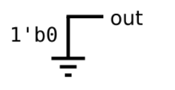

- Module Declaraction 
```verilog
module top_module (
    output out);
```

- Solution
```verilog
module top_module (
    output out);
assign out = 'b0;
endmodule
```

#### - 或非门 (NOR)  

&emsp;&emsp;实现如下电路:

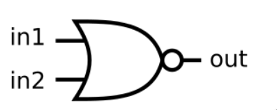

- Module Declaraction 
```verilog
module top_module (
    input in1,
    input in2,
    output out);
```

- Solution
```verilog
module top_module (
    input in1,
    input in2,
    output out);
    assign out = ~(in1|in2);
endmodule
```

#### - 其他的门  

&emsp;&emsp;实现如下电路:

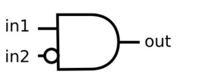

- Module Declaraction 
```verilog
module top_module (
    input in1,
    input in2,
    output out);
```

- Solution
```verilog
module top_module (
    input in1,
    input in2,
    output out);
assign out = in1&~in2;
endmodule
```

#### - 两个门  

&emsp;&emsp;实现如下电路:


- Module Declaraction 
```verilog
module top_module (
    input in1,
    input in2,
    input in3,
    output out);
```

- Solution
```verilog
module top_module (
    input in1,
    input in2,
    input in3,
    output out);
 wire out1;
    
    assign out1 = ~(in1^in2);
    
assign out = in3^ out1;
endmodule
```

#### - 更多的逻辑门  

- Module Declaraction 
```verilog

```

- Solution
```verilog

```

#### - 7420模块  

&emsp;&emsp;创建如下电路:

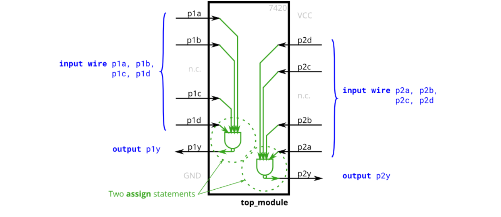

- Module Declaraction 
```verilog
module top_module ( 
    input p1a, p1b, p1c, p1d,
    output p1y,
    input p2a, p2b, p2c, p2d,
    output p2y );
```

- Solution
```verilog
module top_module ( 
    input p1a, p1b, p1c, p1d,
    output p1y,
    input p2a, p2b, p2c, p2d,
    output p2y );
    assign p1y = ~(p1a&p1b&p1c&p1d);
    assign p2y = ~(p2a&p2b&p2c&p2d);
endmodule
```

#### - 真值表  

- Module Declaraction 
```verilog

```

- Solution
```verilog

```

#### - 小练习 -- Two-bit equality  

&emsp;&emsp;若A==B则输出1,否则输出0

- Module Declaraction 
```verilog
module top_module ( input [1:0] A, input [1:0] B, output z ); 
```

- Solution
```verilog
module top_module ( input [1:0] A, input [1:0] B, output z ); 
    assign z = ((A[1]==B[1])&&(A[0]==B[0]))?1:0;
endmodule
```

#### - 简单电路A  

&emsp;&emsp;实现一个模块,具有`z = (x^y) & x`功能

- Module Declaraction 
```verilog
module top_module (input x, input y, output z);
```

- Solution
```verilog
module top_module (input x, input y, output z);
    assign z = (x^y)&x;
endmodule
```

#### - 简单电路B  

&emsp;&emsp;电路B可以通过以下模拟波形来描述：


- Module Declaraction 
```verilog
module top_module ( input x, input y, output z );
```

- Solution
```verilog
module top_module ( input x, input y, output z );
    assign z = ~(x^y);
endmodule
```

#### - 组合电路AB  

&emsp;&emsp;通过电路A,B构建如下电路：


- Module Declaraction 
```verilog
module top_module ( input x, input y, output z );
```

- Solution
```verilog
module top_module (input x, input y, output z);
    wire z1,z2,z3,z4,out1,out2;
    A ins1(x,y,z1);
    B ins2(x,y,z2);
    A ins3(x,y,z3);
    B ins4(x,y,z4);
    assign out1 = z1 | z2;
    assign out2 = z3 & z4;
    assign z = out1 ^ out2;
endmodule

module A(input x, input y, output z);
    assign z = (x^y) & x;
endmodule

module B ( input x, input y, output z );
    assign z = ~(x^y);
endmodule

```

#### - 铃声与震动模式  

- Module Declaraction 
```verilog

```

- Solution
```verilog

```

#### - 恒温器  

&emsp;&emsp;实现一个加热/冷却恒温器控制器.执行一个电路，根据需要打开和关闭加热器、空调和鼓风机风扇。  

&emsp;&emsp;恒温器可以处于两种模式之一：加热（mode=1）和冷却（mode=0）。在加热模式下，当加热器太冷（too_cold=1）时，打开加热器，但不要使用空调。在冷却模式下，当空调太热（too_hot=1）时打开空调，但不要打开加热器。当加热器或空调打开时，也打开风扇使空气循环。 

&emsp;&emsp;此外，即使加热器和空调关闭，用户也可以请求风扇打开（fan_on=1）。  

&emsp;&emsp;尝试只使用assign语句，以查看是否可以将问题描述转换为逻辑门集合。

- Module Declaraction 
```verilog
module top_module (
    input too_cold,
    input too_hot,
    input mode,
    input fan_on,
    output heater,
    output aircon,
    output fan
); 
```

- Solution
```verilog
module top_module (
    input too_cold,
    input too_hot,
    input mode,
    input fan_on,
    output heater,
    output aircon,
    output fan
); 
    always @(*) begin
        if(fan_on == 1) begin
            fan = 1;
        end
        else begin
            fan = 0;
        end
        if(mode == 1) begin
            heater = mode;
            if(too_cold) begin
                heater = 1;
                fan = 1;
                aircon = 0;
            end
            else begin
                heater = 0;
                aircon = 0;
            end
        end
            else begin 
            if(too_hot) begin
                aircon = 1;
                fan = 1;
                heater = 0;
            end
            else begin
                aircon = 0;
                heater = 0;
            end
        end
    end
endmodule
```

#### - 3位计数器  

&emsp;&emsp;计算3位vector中1的个数

- Module Declaraction 
```verilog
module top_module( 
    input [2:0] in,
    output [1:0] out );
```

- Solution
```verilog
module top_module( 
    input [2:0] in,
    output [1:0] out );
    reg [1:0]num;
    integer i;
    always @(*) begin
        num = 0;
        for(i=0;i<3;i=i+1) begin
            if(in[i] == 1) begin
                num = num + 2'b1;          
            end
        end       
    end
    assign out = num;
endmodule
```

#### - 门与容器  

&emsp;&emsp;给定4位vector,请给出每个位与其相临位之间的关系.  
- `out_both`: 判断相应位与其左临位是否均为1,不考虑`in[3]`
- `out_any`: 判断相应位与其右临位是否含有'1',不考虑`in[0]`
- `out_different`: 判断相应位与其左临位是否不同,`in[3[`是`in[0]`的左临位

- Module Declaraction 
```verilog
module top_module( 
    input [3:0] in,
    output [2:0] out_both,
    output [3:1] out_any,
    output [3:0] out_different );
```

- Solution
```verilog
module top_module( 
    input [3:0] in,
    output [2:0] out_both,
    output [3:1] out_any,
    output [3:0] out_different );
    integer i;
    reg [2:0]both;
    reg [3:1]any;
    reg [3:0]different;
    always @(*) begin
        both = 0;
        any = 0;
        different = 0;
        for(i=0;i<3;i=i+1) begin
            if((in[i]&in[i+1]) == 1) begin
                both[i] = 1;
            end
        end
        for(i=1;i<4;i=i+1) begin
            if((in[i]|in[i-1]) == 1) begin
                any[i] = 1;
            end
        end
        for(i=0;i<4;i=i+1) begin
            if(i<3) begin
                if(in[i]^in[i+1]) begin
                    different[i] = 1;
                end
            end
            else begin 
                if(in[3]^in[0]) begin
                    different[3] = 1;
                end
            end
        end
    end
    assign out_both = both;
    assign out_any[3:1] = any[3:1];
    assign out_different = different;
endmodule
```

#### - 更长的数组  

&emsp;&emsp;给定4位vector,请给出每个位与其相临位之间的关系.  
- `out_both`: 判断相应位与其左临位是否均为1,不考虑`in[3]`
- `out_any`: 判断相应位与其右临位是否含有'1',不考虑`in[0]`
- `out_different`: 判断相应位与其左临位是否不同,`in[3[`是`in[0]`的左临位

- Module Declaraction 
```verilog
module top_module( 
    input [99:0] in,
    output [98:0] out_both,
    output [99:1] out_any,
    output [99:0] out_different );
```

- Solution
```verilog
module top_module (
	input [99:0] in,
	output [98:0] out_both,
	output [99:1] out_any,
	output [99:0] out_different
);

	// See gatesv for explanations.
	assign out_both = in & in[99:1];
	assign out_any = in[99:1] | in ;
	assign out_different = in ^ {in[0], in[99:1]};
	
endmodule
```

---

#### **多路选择器**(Multiplexers)  


#### - 2选1多路选择器  
&emsp;&emsp;创建一个1位宽的2对1多路选择器。当sel=0时，选择a；当sel=1时，选择b。

- Module Declaraction 
```verilog
module top_module( 
    input a, b, sel,
    output out ); 	
```

- Solution
```verilog
module top_module (
	input a,
	input b,
	input sel,
	output out
);

	assign out = (sel & b) | (~sel & a);	// Mux expressed as AND and OR
	
	// Ternary operator is easier to read, especially if vectors are used:
	// assign out = sel ? b : a;
	
endmodule
```

#### - 2选1总线选择器  


&emsp;&emsp;创建一个100位宽的2对1多路选择器。当sel=0时，选择a；当sel=1时，选择b。

- Module Declaraction 
```verilog
module top_module( 
    input [99:0] a, b,
    input sel,
    output [99:0] out );
```

- Solution
```verilog
module top_module (
	input [99:0] a,
	input [99:0] b,
	input sel,
	output [99:0] out
);

	assign out = sel ? b : a;
	
	// The following doesn't work. Why?
	// assign out = (sel & b) | (~sel & a);
	
endmodule
```


#### - 9选1多路选择器  

&emsp;&emsp;创建一个16位宽的9对1多路选择器。sel=0选择a，sel=1选择b等。对于未使用的情况（sel=9到15），将所有输出位设置为“1”。
- Module Declaraction 
```verilog
module top_module( 
    input [15:0] a, b, c, d, e, f, g, h, i,
    input [3:0] sel,
    output [15:0] out );
```

- Solution
```verilog
module top_module (
	input [15:0] a,
	input [15:0] b,
	input [15:0] c,
	input [15:0] d,
	input [15:0] e,
	input [15:0] f,
	input [15:0] g,
	input [15:0] h,
	input [15:0] i,
	input [3:0] sel,
	output logic [15:0] out
);

	// Case statements can only be used inside procedural blocks (always block)
	// This is a combinational circuit, so use a combinational always @(*) block.
	always @(*) begin
		out = '1;		// '1 is a special literal syntax for a number with all bits set to 1.
						// '0, 'x, and 'z are also valid.
						// I prefer to assign a default value to 'out' instead of using a
						// default case.
		case (sel)
			4'h0: out = a;
			4'h1: out = b;
			4'h2: out = c;
			4'h3: out = d;
			4'h4: out = e;
			4'h5: out = f;
			4'h6: out = g;
			4'h7: out = h;
			4'h8: out = i;
		endcase
	end
	
endmodule
```

#### - 256选1多路选择器  


&emsp;&emsp;创建一个1位宽、256对1的多路选择器。256个输入全部打包成一个256位输入vector。sel=0选择in[0]，sel=1选择in[1]，sel=2选择in[2]等等。

- Module Declaraction 
```verilog
module top_module( 
    input [255:0] in,
    input [7:0] sel,
    output out );
```

- Solution
```verilog
module top_module (
	input [255:0] in,
	input [7:0] sel,
	output  out
);

	// Select one bit from vector in[]. The bit being selected can be variable.
	assign out = in[sel];
	
endmodule
```

#### - 256选1 4位选则器  

&emsp;&emsp;创建一个4位宽、256对1的多路选择器。sel=0应选择`in[3:0]`，sel=1选择`in[7:4]`，sel=2选择`in[11:8]`等。

- Module Declaraction 
```verilog
module top_module( 
    input [1023:0] in,
    input [7:0] sel,
    output [3:0] out );
```

- Solution
```verilog
module top_module( 
    input [1023:0] in,
    input [7:0] sel,
    output [3:0] out );
    reg [7:0]index;
    assign     out[3:0] = in[4*sel+:4];
endmodule

```

---

#### **卡诺图**  

#### - 3变量  

- Module Declaraction 
```verilog

```

- Solution
```verilog

```

#### - 4变量 -- 练习一  

- Module Declaraction 
```verilog

```

- Solution
```verilog

```

#### - 4变量 -- 练习二  

- Module Declaraction 
```verilog

```

- Solution
```verilog

```

#### - 4变量 -- 练习三  

- Module Declaraction 
```verilog

```

- Solution
```verilog

```

#### - 最小SOP与POS  

- Module Declaraction 
```verilog

```

- Solution
```verilog

```

#### - 卡诺图1  

- Module Declaraction 
```verilog

```

- Solution
```verilog

```

#### - 卡诺图2  

- Module Declaraction 
```verilog

```

- Solution
```verilog

```

#### - 多路选择器实现 K-map  

- Module Declaraction 
```verilog

```

- Solution
```verilog

```

---

### 时序逻辑 (Sequential Login)  

#### **锁存器与触发器**  

#### - D-触发器(D flip-flops)  

&emsp;&emsp;D-触发器可以存储一个bit数据并根据时钟信号周期的更新数据，一般是由正边沿触发。
&emsp;&emsp;D-触发器由逻辑合成器(Logic synthesizer)在使用"Always block"时创建(参见AlwaysBlock2)。D-触发器是"组合逻辑块之后连接触发器"的最简单形式，其中组合逻辑部分只是一个wire类型变量。

  

&emsp;&emsp;创建一个D-触发器。

- **Module Declaration**  

```verilog
module top_module (
    input clk,
    input [7:0] d,
    output [7:0] q
);
```

- **Solution**
```verilog
module top_module (
    input clk,    // Clocks are used in sequential circuits
    input d,
    output reg q );//

    // Use a clocked always block   使用Always block
    //   copy d to q at every positive edge of clk  在时钟信号上升沿时将q复制给d  
    //   Clocked always blocks should use non-blocking assignments  
    /*在Always block内永远都不要使用赋值(Assignment),即assign关键字*/
    always @(posedge clk) begin
        q = d;
    end

endmodule
```

#### - D触发器组合  

&emsp;&emsp;创建8个D触发器，所有的D触发器均由时钟上升沿触发。  

- **Module Declaration**
```verilog
module top_module (
    input clk,
    input [7:0] d,
    output [7:0] q
);
```

- **Solution**  
```verilog
module top_module (
    input clk,
    input [7:0] d,
    output [7:0] q
);
    always @(posedge clk) begin
        q = d;
    end
endmodule
```

#### - 可复位(Reset)的DFF  
&emsp;&emsp;使用主动高位同步复位信号(Reset)创建8个D-触发器。所有的触发器均由时钟上升沿信号触发.  

- **Module Declaration**  
```verilog
module top_module (
    input clk,
    input reset,            // Synchronous reset
    input [7:0] d,
    output [7:0] q
);
```

- **Solution**
```verilog
module top_module (
    input clk,
    input reset,            // Synchronous reset
    input [7:0] d,
    output [7:0] q
);
    always @(posedge clk) begin
        q <= d & {8{~reset}};
    end
endmodule
```

#### - 可复位为特殊值的D-触发器  
&emsp;&emsp;使用主动高位同步复位信号(Reset)创建8个D-触发器。触发器必须重置为0x34而不是零。所有DFF都应该由CLK的下降沿触发。

- **Module Declaration**
```verilog
module top_module (
    input clk,
    input reset,
    input [7:0] d,
    output [7:0] q
);
```

- **Solution**
```verilog
module top_module (
    input clk,
    input reset,
    input [7:0] d,
    output [7:0] q
);
    always @(negedge clk) begin
        if(reset) begin
            q <= {8{6'h34}};
        end
        else begin
            q <= d;
        end
    end
endmodule
```

#### - 可异步复位的触发器(Asynchronous Reset)  

&emsp;&emsp;使用主动高位异步复位信号创建8个D-触发器。所有DFF都应该由时钟上升沿触发。 

- **Module Declaration**
```verilog
module top_module (
    input clk,
    input areset,   // active high asynchronous reset
    input [7:0] d,
    output [7:0] q
);
```

- **Solution**
```verilog
module top_module (
    input clk,
    input areset,   // active high asynchronous reset
    input [7:0] d,
    output [7:0] q
);
    always @(posedge clk or posedge areset) begin
        if(areset == 1) begin
            q <= 0;
        end
        else begin
            q <= d;
        end
    end
endmodule
```

#### - 有开关的触发器  

&emsp;&emsp;创建16个D-触发器。有时我们希望只修改触发器组的部分值。输入的***开关字节***控制16个寄存器的每个字节是否应在该循环中写入。`byteena[1]`控制上字节`d[15:8]`，而`byteena[0]`控制下字节`d[7:0]`。
&emsp;&emsp;`resetn`是一个同步的、主动的低重置。
&emsp;&emsp;所有DFF都应该由时钟的上升沿触发。

- **Module Delclaration**  
```verilog
module top_module (
    input clk,
    input resetn,
    input [1:0] byteena,
    input [15:0] d,
    output [15:0] q
);
```

- **Solution**  
```verilog
module top_module (
    input clk,
    input resetn,
    input [1:0] byteena,
    input [15:0] d,
    output [15:0] q
);
    always @(posedge clk) begin
        if(resetn == 1) begin
            if(byteena[0] == 1) begin
                q[7:0] <= d[7:0];
            end
            if(byteena[1] == 1) begin
                q[15:8] <= d[15:8];
            end
        end
        else if(resetn == 0) begin
            q <= 0;
        end
    end
endmodule
```

#### - D-锁存器(D Latch)  

&emsp;&emsp;实现如下电路:  
  

> 请注意,这是一个锁存器,因此Quartus会报锁存警告  

- **Module Declaration**  
```verilog
module top_module (
    input d, 
    input ena,
    output q);
```

```verilog
module top_module (
    input d, 
    input ena,
    output q);
    wire in,out1,out2;
    always @(*) begin
        out1 = ~(out2 | (~d)&ena);
        out2 = ~(out1 | d&ena);
        q = out1;
    end
endmodule
```

#### - DFF练习1  

&emsp;&emsp;请实现如下电路:  
  

- **Module Declaration**  
```verilog
module top_module (
    input clk,
    input d, 
    input ar,   // asynchronous reset
    output q);
```

- **Solution**  
```verilog
module top_module (
    input clk,
    input d, 
    input ar,   // asynchronous reset
    output q);
    wire out1,out2;
    always @(posedge clk or posedge ar) begin
        if(ar == 1) begin
            q <= 0;
        end
        else if(ar == 0) begin
            q <= d;
        end
    end
endmodule
```

#### - DFF2  

&emsp;&emsp;实现如下电路:  
  

- **Module Declaration**  
```verilog
module top_module (
    input clk,
    input d, 
    input r,   // synchronous reset
    output q);
```

- **Solution**  
```verilog
module top_module (
    input clk,
    input d, 
    input r,   // synchronous reset
    output q);
    always @(posedge clk) begin
        if(r) begin
            q <= 0;
        end
        else begin
            q = d;
        end
    end
endmodule
```

#### - DFF和gate  

&emsp;&emsp;实现如下电路:  
  

- **Module Declaration**  
```verilog
module top_module (
    input clk,
    input in, 
    output out);
```

- **Solution**  
```verilog
module top_module (
    input clk,
    input in, 
    output out);
    wire out1,out2;
    always @(posedge clk) begin
        out1 = out2 ^ in;
        out2 = out1;
        out = out2;
    end
endmodule
```

#### - 多路选择器与触发器1  

&emsp;&emsp;考虑如下时序电路:  
  

&emsp;&emsp;假设您想为如下电路实现层级化(Hierarchical)的代码,使用3个子级模块的实例,子级模块由触发器与多路选择器构成.您的顶级模块应当由含子级模块实现.

> 注: 这是一种封装的思想  

- **Module Declaration**  
```verilog
module top_module (
	input clk,
	input L,
	input r_in,
	input q_in,
	output reg Q);
```

- **Solution**  
```verilog
module top_module (
        input clk,
        input L,
        input r_in,
        input q_in,
        output reg Q);

    wire out1;
    always @(*) begin
        case (L)
            1'b0: begin
                out1 <= q_in;
            end
            1'b1: begin
                out1 <= r_in;
            end
        endcase
    end
    always @(posedge clk) begin
        Q <= out1;
    end
endmodule
```

#### - 多路选择器与触发器2  

&emsp;&emsp;考虑如下n位变换寄存器电路:  
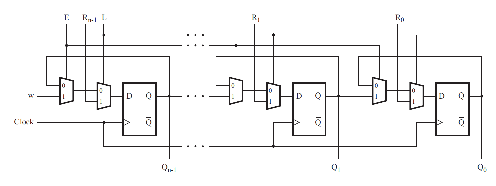

&emsp;&emsp;为这个电路实现一个一阶模块,并命名为`top_module`,可供此电路调用.你的模块应包括触发器与多路选择器.  

- **Module Declaration**  
```verilog
module top_module (
    input clk,
    input w, R, E, L,
    output Q
);
```

- **Solution**  
```verilog
module top_module (
    input clk,
    input w, R, E, L,
    output Q
);
    wire out1,out2;
    always @(posedge clk) begin
        case (E)
            1'b0: begin
                out1 = Q;
            end
            1'b1: begin
                out1 = w;
            end
        endcase
        case (L)
            1'b0: begin
                Q = out1;
            end
            1'b1: begin
                Q = R;
            end
        endcase
    end
endmodule
```

#### - DFFs和gates  

&emsp;&emsp;给定如下有限状态机电路,假设D-触发器在状态机开始前被初始化为0.  

&emsp;&emsp;构建如下电路.  
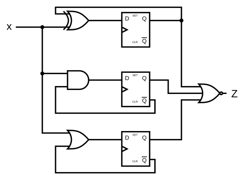  

- **Module Declaration**  
```verilog
module top_module (
    input clk,
    input x,
    output z
); 
```

- **Solution**  
```verilog
module top_module (
    input clk,
    input x,
    output z
); 
    reg out1, out2, out3;
    initial z = 1;
    always @(posedge clk) begin
        out1 = x ^ out1;
        out2 = x & ~out2;
        out3 = x | ~out3;
        z = ~(out1 | out2 | out3);
    end
endmodule
```

#### - 根据真值表实现电路  

&emsp;&emsp;JK触发器有如下真值表.通过一个D-触发器和几个gate实现一个JK触发器.  

> 注意:Qold是D-触发器在上升沿之前的输出.

|J|K|Q|
|:--:|:---:|:--:|
|0|0|Qold|
|0|1|0|
|1|0|1|
|1|1|~Qold|

- **Module Declaration**
```verilog
module top_module (
    input clk,
    input j,
    input k,
    output Q); 
```

- **Solution**  
```verilog
module top_module (
    input clk,
    input j,
    input k,
    output Q); 
    wire old = Q;
    always @(posedge clk) begin
        if(j^k) begin
            Q = j;
        end
        else begin
            Q = j?~old:old;
        end
    end
endmodule
```

#### - 边缘检测(Detect an edge)  

&emsp;&emsp;对于每一个8位容器,在一个时钟周期内,当输入信号从0,变为下个周期的1时进行检测.(类似于上升沿检测).当对应位从0变为1时应当设置输出位.

&emsp;&emsp;以下为波形样例,为了清楚起见,`in[1]`与`pedge[1]`被分别显示.  
  

- **Module Declaration**
```verilog
module top_module (
    input clk,
    input [7:0] in,
    output [7:0] pedge
);
```

- **Solution**  
```verilog
module top_module(
	input clk,
	input [7:0] in,
	output reg [7:0] pedge);
	
	reg [7:0] d_last;	
			
	always @(posedge clk) begin
		d_last <= in;			// Remember the state of the previous cycle
		pedge <= in & ~d_last;	// A positive edge occurred if input was 0 and is now 1.
	end
	
endmodule
```

#### - 边缘检测2  
&emsp;&emsp;对于每一个8位容器,在一个时钟周期内,当输入信号从0,变为下个周期的1时进行检测.(上升沿与下降沿均触发).当对应位从0变为1时应当设置输出位.  

&emsp;&emsp;以下为波形样例,为了清楚起见,`in[1]`与`anyedge[1]`被分别显示.  


- **Module Declaration**  
```verilog
module top_module (
    input clk,
    input [7:0] in,
    output [7:0] anyedge
);
```

- **Solution**  
```verilog
module top_module (
    input clk,
    input [7:0] in,
    output [7:0] anyedge
);
   reg [7:0] temp;
   always @(posedge clk) begin
       temp <= in;
       anyedge <= temp ^ in;
   end
endmodule
```

#### - 边缘捕获寄存器(Edge capture register)  

&emsp;&emsp;对于32位Vector中的每一位，当输入信号在一个时钟周期内从1变为下一个时钟周期的0时进行捕获。"捕获"表示输出将保持1，直到寄存器复位（同步复位 -- Synchronous Reset）。

&emsp;&emsp;每个输出位的行为类似于SR触发器：在发生1到0的转换之后，输出位应该被设置为1。当复位为高电平时，输出位应在上升沿复位(至0)。如果上述两个事件同时发生，则重置(Reset)具有优先权。在下面示例波形的最后4个周期中，"Reset"事件比"Set"事件早一个周期，因此这里没有冲突。


- **Module Declaration**  
```verilog
module top_module (
    input clk,
    input reset,
    input [31:0] in,
    output [31:0] out
);
```

- **Solution**
```verilog
module top_module (
    input clk,
    input reset,
    input [31:0] in,
    output [31:0] out
);
    reg [31:0] old,result,temp;
    initial temp = 0;
    always @(posedge clk) begin
        if(reset) begin
            old = in;
            result = 0;
            out = 0;
        end
        else begin
            temp = (in ^ old) & old;
            result = result | temp;
            out = result;
            old = in;
        end
    end 
endmodule
```

#### - 双边沿出发(Dualedge)

&emsp;&emsp;你现在已经比较熟悉上升沿或者下降沿出发的触发器了.而双边触发器在时钟上升沿与下降沿都会触发.但是FPGA并没有双边沿触发器,并且`always @(posedge clk or negedge clk)`是非法的.  

&emsp;&emsp;构建一个电路来实现类似于双边触发器的功能:  


> 注意:并不需要完全等效:在这里触发器的输出没什么毛病,但是在更大的电路中模拟这种行为可能会有故障,我们在这里忽略这个细节.  

- Hint:  
  - 你不能在FPGA上创建双边沿触发器,但是组合上升沿与下降沿触发器.  
  - 这个问题是一个中等难度的电路设计问题，但只需要基本的verilog语言特性.(这是一个电路设计问题，而不是编码问题.)在试图对电路进行编码之前，先用手画出电路草图可能会有所帮助。

- **Module Declaraction**  
```verilog
module top_module (
    input clk,
    input d,
    output q
);
```

- **Solution**
```verilog
module top_module (
    input clk,
    input d,
    output q
);
    reg [1:0] status;
    always @(posedge clk) begin
        status[0] = d;
    end
    always @(negedge clk) begin
        status[1] = d;
    end
    assign q = clk ? status[0] : status[1];
endmodule
```


#### **计数器(Counters)**  

#### - **四位二进制计数器**  

&emsp;&emsp;构建一个0-15的四位二进制计数器,句点为16.重置输入是同步的,应将计数器重置为0. 

- **Module Declaration**  
```verilog
module top_module (
    input clk,
    input reset,      // Synchronous active-high reset
    output [3:0] q);
```

- **Solution**  
```verilog
module top_module (
    input clk,
    input reset,      // Synchronous active-high reset
    output [3:0] q);
    always @(posedge clk) begin
        if(!reset) begin
            if(q == 4'hf) begin
                q = 0;
            end
            else begin
                q = q + 1;
            end
        end
        else begin
            q = 0;
        end
    end
endmodule
```

#### - 十进制计数器  

&emsp;&emsp;建立一个从0到9的十进制计数器,句点为10,重置输入是同步的,应该将计数器重置为0.  
  

- **Module Declaration**  
```verilog
    input clk,
    input reset,        // Synchronous active-high reset
    output [3:0] q);
```

- **Solution**  
```verilog
module top_module (
    input clk,
    input reset,        // Synchronous active-high reset
    output [3:0] q);
    
    always @(posedge clk) begin
        if(reset) begin
            q <= 0;
        end
        else begin
            if(q = 4'd10) begin
                q = 0;
            end
            else begin
                q = q + 1;
            end
        end
    end
endmodule
```

#### - 十进制计数器1  

&emsp;&emsp;建立一个从0到9的十进制计数器,句点为10,重置输入是同步的,应该将计数器重置为1.  
  

- **Module Declaration**  
```verilog
module top_module (
    input clk,
    input reset,
    output [3:0] q);
```

- **Solution**  
```verilog
module top_module (
    input clk,
    input reset,
    output [3:0] q);
    always @(posedge clk) begin
        if(reset) begin
            q <= 1;
        end
        else begin
            if(q == 4'ha) begin
                q = 1;
            end
            else begin
                q = q + 1;
            end
        end
    end
endmodule
```

#### - **慢序十进制计数器**  

&emsp;&emsp;构建一个0到9的十进制计数器,句点为10.reset信号是同步的,将计数器置零.我们希望能够暂停计数器,而不是在每个时钟周期内增加,因此slowena控制计数器的增加.  


- **Module Declaration**  
```verilog
module top_module (
    input clk,
    input slowena,
    input reset,
    output [3:0] q);
```

- **Solution**  
``` verilog
module top_module (
    input clk,
    input slowena,
    input reset,
    output [3:0] q);
    always @(posedge clk) begin
        if(reset) begin
            q <= 0;
        end
        else begin
            if(slowena) begin
                if(q == 4'd9) begin 
                    q = 0;
                end
                else begin
                    q = q + 1;
                end
            end
            else begin
                q = q + 0;
            end
        end
    end
endmodule
```

#### - **Counter1-12**  

设计一个具有以下输入输出的Counter:  
 - 同步高位`Reset`信号将寄存器重置为0  
- 当`enable`为高位时Counter进行工作  
- 时钟信号上升沿触发  
- `Q[3:0]` 为counter的输出  
- `c_enable, c_load, c_d[3:0]`三个控制信号发送到所提供的4-bit Counter模块,以便检验正确操作.  
你可以使用如下组件:  

&emsp;&emsp;如下4位计数器,`enable`与`load`同步并行输入(load的优先级高于enable).这个count4模块提供给你,在你的模块中实例化他.  
```verilog
module count4(
	input clk,
	input enable,
	input load,
	input [3:0] d,
	output reg [3:0] Q
);
```


- **Module Declaration**
```verilog
module top_module (
    input clk,
    input reset,
    input enable,
    output [3:0] Q,
    output c_enable,
    output c_load,
    output [3:0] c_d
); 
```

- **Solution**  
```verilog
module top_module (
    input clk,
    input reset,
    input enable,
    output [3:0] Q,
    output c_enable,
    output c_load,
    output [3:0] c_d
); //
    wire [3:0] Q_tmp;
    assign c_enable = enable;
    assign c_d = c_load ? 1 : 0;
    always @(posedge clk) begin
        if(reset) begin
            Q <= 1;
            Q_tmp <= 1;
        end
        else begin
            if(enable) begin
                if(Q == 12) begin
                    Q <= 1;
                    Q_tmp <= 1;
                end
                else begin
                    Q <= Q + 1;
                    Q_tmp <= Q_tmp + 1;
                end
            end
        end
    end
    
    always @(*) begin
        if(reset || (Q == 12 && c_enable)) begin
            c_load <= 1;
        end
        else begin
            c_load <= 0;
        end
    end

    count4 the_counter (clk, c_enable, c_load, c_d, Q_tmp);

endmodule
```

#### - 4位左右移寄存器(4-bit shift regisger)  


#### - 4位左右旋转器(Left/right rotator)  


#### - 算数左右移  

&emsp;&emsp;构建一个64为算数寄存器,具有同步load信号.这个shifter根据`amount`信号选择,可左右移1位或8位.  
&emsp;&emsp;在算数右移时,若符号位(q[63])为1则需要复制位,而并非简单的逻辑右移.另一种考虑方式,假定被移位的数字有符号并保留符号,这样算术右移将有符号数字除以2的幂.  
&emsp;&emsp;算数左移与逻辑左移没有区别.  

- `load`: 寄存器载入数据(优先级最高)  
- `ena`: 决定是否发生位移  
- `amount`: 决定位移的方向  
  - 2'b00: 左移一位  
  - 2'b01: 左移8位  
  - 2'b10: 右移一位  
  - 2'b11: 右移8位  
- `q`: shifter的内容

- **Module Declaration**  
```verilog
module top_module(
    input clk,
    input load,
    input ena,
    input [1:0] amount,
    input [63:0] data,
    output reg [63:0] q); 
```

- **Solution**  
```verilog
module top_module(
    input clk,
    input load,
    input ena,
    input [1:0] amount,
    input [63:0] data,
    output reg [63:0] q); 
    always @(posedge clk) begin
        if(load) begin
            q <= data;
        end
        else begin
            if(ena) begin
                case (amount)
                    2'b00: begin 
                        q <= q << 1;
                    end
                    2'b01: begin
                        q <= q << 8;
                    end
                    2'b10: begin
                        q <= q >> 1;
                        if(q[63] == 1) begin
                            q[63] <= 1;
                        end
                    end
                    2'b11: begin
                        q <= q >> 8;
                        if(q[63] == 1) begin
                            q[63:56] <= {8{1'b1}};
                        end
                    end
                endcase
            end
        end
    end
endmodule
```


---

### 练习 -- 更大型电路  

---


