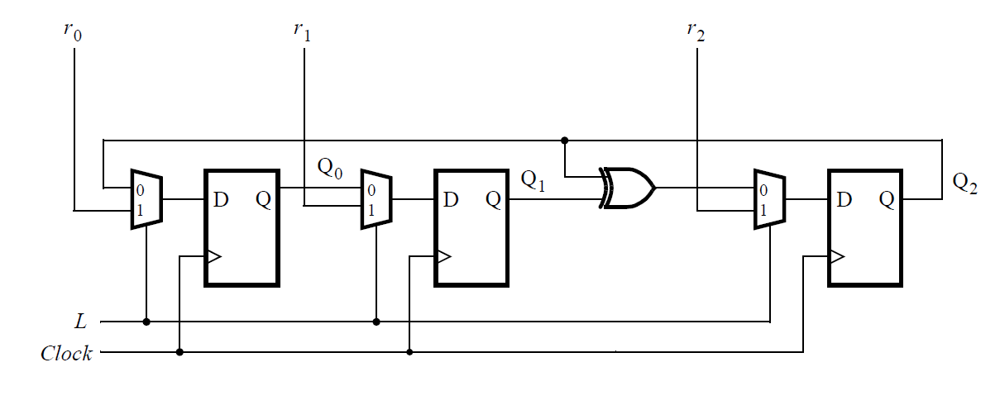
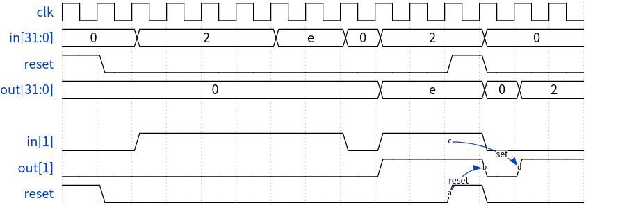
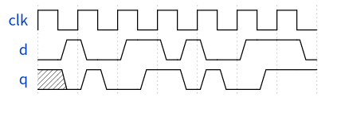

# verilog 文档整理  
---

## 入门  

#### - 如何开始  

#### - 输出0

---

## Verilog 语言  

### 基础元素  

#### - wire类型  

#### - Four wires  

#### - 反转器 (Inveter)  

#### - 与门 (AND gate)  

#### - 或非门 (NOR gate)  

#### - 异或非门 (XNOR gate)  

#### - 声明wires  

#### - 7458模块

---

### 容器(Vectors)  

#### - 容器介绍

#### - 容器细节

#### - 容器的片选(Vector part select)  

#### - 位级操作(Bitwise operators)  

#### - 4位Vecotr  

#### - Vector连接操作符(Vector concatenation operator)  

#### - 反转Vector  

#### - 拷贝操作符(Replication operator)  

#### - 拷贝练习  

---

### 模块与层级(Modules: Hierarchy)  

#### - 模块  

#### - 按位置连接端口(Connecting ports by position)  

#### - 按名称连接端口(Connecting ports by name)  

#### - 三个模块  

#### - 模块与容器  

#### - 加法器1  

#### - 加法器2

#### - 进位选择加法器  

#### - 加-减法器(Adder-subtractor)

---

### 过程(Procedures)  

#### - Always块 -- 组合逻辑 (Always blocks -- Combinational)  

#### - Always块 -- 时序逻辑 (Always blocks -- Clocked)  

#### - If语句  

#### - If语句引发的锁存(latches)  

#### - Case语句  

#### - 简单编码器1  

#### - 简单编码器2  

#### - 避免锁存

---

### 更多语法特点  

#### - 三目算符 

#### - 优化运算1  

#### - 优化运算2  

#### - 循环 -- 组合逻辑:实现Vector反转  

#### - 循环 -- 组合逻辑:实现255位计数器  

#### - 循环:实现100位加法器  

#### - 循环:实现100位BCD加法器  

---

## 电路 (Circuits)

### 组合逻辑 (Combinational Login)  

#### **基础门电路**   

#### - Wire类型  

#### - 接地 -- GND

#### - 或非门 (NOR)  

#### - 其他的门  

#### - 两个门  

#### - 更多的逻辑门  

#### - 7420模块  

#### - 真值表  

#### - 小练习 -- Two-bit equality  

#### - 简单电路A  

#### - 简单电路B  

#### - 组合电路AB  

#### - 铃声与震动模式  

#### - 恒温器  

#### - 3位计数器  

#### - 门与容器  

#### - 更长的数组  

---

#### **多路选择器**(Multiplexers)  

#### - 2选1多路选择器  

#### - 2选1总线选择器  

#### - 9选1多路选择器  

#### - 256选1多路选择器  

#### - 256选1 4位选则器  

---

#### **卡诺图**  

#### - 3变量  

#### - 4变量 -- 练习一  

#### - 4变量 -- 练习二  

#### - 4变量 -- 练习三  

#### - 最小SOP与POS  

#### - 卡诺图1  

#### - 卡诺图2  

#### - 多路选择器实现 K-map  

---

### 时序逻辑 (Sequential Login)  

#### **锁存器与触发器**  

#### - D-触发器(D flip-flops)  

&emsp;&emsp;D-触发器可以存储一个bit数据并根据时钟信号周期的更新数据，一般是由正边沿触发。
&emsp;&emsp;D-触发器由逻辑合成器(Logic synthesizer)在使用"Always block"时创建(参见AlwaysBlock2)。D-触发器是"组合逻辑块之后连接触发器"的最简单形式，其中组合逻辑部分只是一个wire类型变量。

  

&emsp;&emsp;创建一个D-触发器。

- **Module Declaration**  

```verilog
module top_module (
    input clk,
    input [7:0] d,
    output [7:0] q
);

```

- **Solution**
```verilog
module top_module (
    input clk,    // Clocks are used in sequential circuits
    input d,
    output reg q );//

    // Use a clocked always block   使用Always block
    //   copy d to q at every positive edge of clk  在时钟信号上升沿时将q复制给d  
    //   Clocked always blocks should use non-blocking assignments  
    /*在Always block内永远都不要使用赋值(Assignment),即assign关键字*/
    always @(posedge clk) begin
        q = d;
    end

endmodule
```

#### - D触发器组合  

&emsp;&emsp;创建8个D触发器，所有的D触发器均由时钟上升沿触发。  

- **Module Declaration**
```verilog
module top_module (
    input clk,
    input [7:0] d,
    output [7:0] q
);
```

- **Solution**  
```verilog
module top_module (
    input clk,
    input [7:0] d,
    output [7:0] q
);
    always @(posedge clk) begin
        q = d;
    end
endmodule
```

#### - 可复位(Reset)的DFF  
&emsp;&emsp;使用主动高位同步复位信号(Reset)创建8个D-触发器。所有的触发器均由时钟上升沿信号触发.  

- **Module Declaration**  
```verilog
module top_module (
    input clk,
    input reset,            // Synchronous reset
    input [7:0] d,
    output [7:0] q
);
```

- **Solution**
```verilog
module top_module (
    input clk,
    input reset,            // Synchronous reset
    input [7:0] d,
    output [7:0] q
);
    always @(posedge clk) begin
        q <= d & {8{~reset}};
    end
endmodule
```

#### - 可复位为特殊值的D-触发器  
&emsp;&emsp;使用主动高位同步复位信号(Reset)创建8个D-触发器。触发器必须重置为0x34而不是零。所有DFF都应该由CLK的下降沿触发。

- **Module Declaration**
```verilog
module top_module (
    input clk,
    input reset,
    input [7:0] d,
    output [7:0] q
);
```

- **Solution**
```verilog
module top_module (
    input clk,
    input reset,
    input [7:0] d,
    output [7:0] q
);
    always @(negedge clk) begin
        if(reset) begin
            q <= {8{6'h34}};
        end
        else begin
            q <= d;
        end
    end
endmodule
```

#### - 可异步复位的触发器(Asynchronous Reset)  

&emsp;&emsp;使用主动高位异步复位信号创建8个D-触发器。所有DFF都应该由时钟上升沿触发。 

- **Module Declaration**
```verilog
module top_module (
    input clk,
    input areset,   // active high asynchronous reset
    input [7:0] d,
    output [7:0] q
);
```

- **Solution**
```verilog
module top_module (
    input clk,
    input areset,   // active high asynchronous reset
    input [7:0] d,
    output [7:0] q
);
    always @(posedge clk or posedge areset) begin
        if(areset == 1) begin
            q <= 0;
        end
        else begin
            q <= d;
        end
    end
endmodule
```

#### - 有开关的触发器  

&emsp;&emsp;创建16个D-触发器。有时我们希望只修改触发器组的部分值。输入的***开关字节***控制16个寄存器的每个字节是否应在该循环中写入。`byteena[1]`控制上字节`d[15:8]`，而`byteena[0]`控制下字节`d[7:0]`。
&emsp;&emsp;`resetn`是一个同步的、主动的低重置。
&emsp;&emsp;所有DFF都应该由时钟的上升沿触发。

- **Module Delclaration**  
```verilog
module top_module (
    input clk,
    input resetn,
    input [1:0] byteena,
    input [15:0] d,
    output [15:0] q
);
```

- **Solution**  
```verilog
module top_module (
    input clk,
    input resetn,
    input [1:0] byteena,
    input [15:0] d,
    output [15:0] q
);
    always @(posedge clk) begin
        if(resetn == 1) begin
            if(byteena[0] == 1) begin
                q[7:0] <= d[7:0];
            end
            if(byteena[1] == 1) begin
                q[15:8] <= d[15:8];
            end
        end
        else if(resetn == 0) begin
            q <= 0;
        end
    end
endmodule
```

#### - D-锁存器(D Latch)  

&emsp;&emsp;实现如下电路:  
  

> 请注意,这是一个锁存器,因此Quartus会报锁存警告  

- **Module Declaration**  
```verilog
module top_module (
    input d, 
    input ena,
    output q);
```

```verilog
module top_module (
    input d, 
    input ena,
    output q);
    wire in,out1,out2;
    always @(*) begin
        out1 = ~(out2 | (~d)&ena);
        out2 = ~(out1 | d&ena);
        q = out1;
    end
endmodule
```

#### - DFF练习1  

&emsp;&emsp;请实现如下电路:  
  

- **Module Declaration**  
```verilog
module top_module (
    input clk,
    input d, 
    input ar,   // asynchronous reset
    output q);
```

- **Solution**  
```verilog
module top_module (
    input clk,
    input d, 
    input ar,   // asynchronous reset
    output q);
    wire out1,out2;
    always @(posedge clk or posedge ar) begin
        if(ar == 1) begin
            q <= 0;
        end
        else if(ar == 0) begin
            q <= d;
        end
    end
endmodule
```

#### - DFF2  

&emsp;&emsp;实现如下电路:  
  

- **Module Declaration**  
```verilog
module top_module (
    input clk,
    input d, 
    input r,   // synchronous reset
    output q);
```

- **Solution**  
```verilog
module top_module (
    input clk,
    input d, 
    input r,   // synchronous reset
    output q);
    always @(posedge clk) begin
        if(r) begin
            q <= 0;
        end
        else begin
            q = d;
        end
    end
endmodule
```

#### - DFF和gate  

&emsp;&emsp;实现如下电路:  
  

- **Module Declaration**  
```verilog
module top_module (
    input clk,
    input in, 
    output out);
```

- **Solution**  
```verilog
module top_module (
    input clk,
    input in, 
    output out);
    wire out1,out2;
    always @(posedge clk) begin
        out1 = out2 ^ in;
        out2 = out1;
        out = out2;
    end
endmodule
```

#### - 多路选择器与触发器1  

&emsp;&emsp;考虑如下时序电路:  
  

&emsp;&emsp;假设您想为如下电路实现层级化(Hierarchical)的代码,使用3个子级模块的实例,子级模块由触发器与多路选择器构成.您的顶级模块应当由含子级模块实现.

> 注: 这是一种封装的思想  

- **Module Declaration**  
```verilog
module top_module (
	input clk,
	input L,
	input r_in,
	input q_in,
	output reg Q);
```

- **Solution**  
```verilog
module top_module (
        input clk,
        input L,
        input r_in,
        input q_in,
        output reg Q);

    wire out1;
    always @(*) begin
        case (L)
            1'b0: begin
                out1 <= q_in;
            end
            1'b1: begin
                out1 <= r_in;
            end
        endcase
    end
    always @(posedge clk) begin
        Q <= out1;
    end
endmodule
```

#### - 多路选择器与触发器2  

&emsp;&emsp;考虑如下n位变换寄存器电路:  


&emsp;&emsp;为这个电路实现一个一阶模块,并命名为`top_module`,可供此电路调用.你的模块应包括触发器与多路选择器.  

- **Module Declaration**  
```verilog
module top_module (
    input clk,
    input w, R, E, L,
    output Q
);
```

- **Solution**  
```verilog
module top_module (
    input clk,
    input w, R, E, L,
    output Q
);
    wire out1,out2;
    always @(posedge clk) begin
        case (E)
            1'b0: begin
                out1 = Q;
            end
            1'b1: begin
                out1 = w;
            end
        endcase
        case (L)
            1'b0: begin
                Q = out1;
            end
            1'b1: begin
                Q = R;
            end
        endcase
    end
endmodule
```

#### - DFFs和gates  

&emsp;&emsp;给定如下有限状态机电路,假设D-触发器在状态机开始前被初始化为0.  

&emsp;&emsp;构建如下电路.  
  

- **Module Declaration**  
```verilog
module top_module (
    input clk,
    input x,
    output z
); 
```

- **Solution**  
```verilog
module top_module (
    input clk,
    input x,
    output z
); 
    reg out1, out2, out3;
    initial z = 1;
    always @(posedge clk) begin
        out1 = x ^ out1;
        out2 = x & ~out2;
        out3 = x | ~out3;
        z = ~(out1 | out2 | out3);
    end
endmodule
```

#### - 根据真值表实现电路  

&emsp;&emsp;JK触发器有如下真值表.通过一个D-触发器和几个gate实现一个JK触发器.  

> 注意:Qold是D-触发器在上升沿之前的输出.

|J|K|Q|
|:--:|:---:|:--:|
|0|0|Qold|
|0|1|0|
|1|0|1|
|1|1|~Qold|

- **Module Declaration**
```verilog
module top_module (
    input clk,
    input j,
    input k,
    output Q); 
```

- **Solution**  
```verilog
module top_module (
    input clk,
    input j,
    input k,
    output Q); 
    wire old = Q;
    always @(posedge clk) begin
        if(j^k) begin
            Q = j;
        end
        else begin
            Q = j?~old:old;
        end
    end
endmodule
```

#### - 边缘检测(Detect an edge)  

&emsp;&emsp;对于每一个8位容器,在一个时钟周期内,当输入信号从0,变为下个周期的1时进行检测.(类似于上升沿检测).当对应位从0变为1时应当设置输出位.

&emsp;&emsp;以下为波形样例,为了清楚起见,`in[1]`与`pedge[1]`被分别显示.  
  

- **Module Declaration**
```verilog
module top_module (
    input clk,
    input [7:0] in,
    output [7:0] pedge
);
```

- **Solution**  
```verilog
module top_module(
	input clk,
	input [7:0] in,
	output reg [7:0] pedge);
	
	reg [7:0] d_last;	
			
	always @(posedge clk) begin
		d_last <= in;			// Remember the state of the previous cycle
		pedge <= in & ~d_last;	// A positive edge occurred if input was 0 and is now 1.
	end
	
endmodule
```

#### - 边缘检测2  
&emsp;&emsp;对于每一个8位容器,在一个时钟周期内,当输入信号从0,变为下个周期的1时进行检测.(上升沿与下降沿均触发).当对应位从0变为1时应当设置输出位.  

&emsp;&emsp;以下为波形样例,为了清楚起见,`in[1]`与`anyedge[1]`被分别显示.  


- **Module Declaration**  
```verilog
module top_module (
    input clk,
    input [7:0] in,
    output [7:0] anyedge
);
```

- **Solution**  
```verilog
module top_module (
    input clk,
    input [7:0] in,
    output [7:0] anyedge
);
   reg [7:0] temp;
   always @(posedge clk) begin
       temp <= in;
       anyedge <= temp ^ in;
   end
endmodule
```

#### - 边缘捕获寄存器(Edge capture register)  

&emsp;&emsp;对于32位Vector中的每一位，当输入信号在一个时钟周期内从1变为下一个时钟周期的0时进行捕获。"捕获"表示输出将保持1，直到寄存器复位（同步复位 -- Synchronous Reset）。

&emsp;&emsp;每个输出位的行为类似于SR触发器：在发生1到0的转换之后，输出位应该被设置为1。当复位为高电平时，输出位应在上升沿复位(至0)。如果上述两个事件同时发生，则重置(Reset)具有优先权。在下面示例波形的最后4个周期中，"Reset"事件比"Set"事件早一个周期，因此这里没有冲突。


- **Module Declaration**  
```verilog
module top_module (
    input clk,
    input reset,
    input [31:0] in,
    output [31:0] out
);
```

- **Solution**
```verilog
module top_module (
    input clk,
    input reset,
    input [31:0] in,
    output [31:0] out
);
    reg [31:0] old,result,temp;
    initial temp = 0;
    always @(posedge clk) begin
        if(reset) begin
            old = in;
            result = 0;
            out = 0;
        end
        else begin
            temp = (in ^ old) & old;
            result = result | temp;
            out = result;
            old = in;
        end
    end 
endmodule
```

#### - 双边沿出发(Dualedge)

&emsp;&emsp;你现在已经比较熟悉上升沿或者下降沿出发的触发器了.而双边触发器在时钟上升沿与下降沿都会触发.但是FPGA并没有双边沿触发器,并且`always @(posedge clk or negedge clk)`是非法的.  

&emsp;&emsp;构建一个电路来实现类似于双边触发器的功能:  


> 注意:并不需要完全等效:在这里触发器的输出没什么毛病,但是在更大的电路中模拟这种行为可能会有故障,我们在这里忽略这个细节.  

- Hint:  
  - 你不能在FPGA上创建双边沿触发器,但是组合上升沿与下降沿触发器.  
  - 这个问题是一个中等难度的电路设计问题，但只需要基本的verilog语言特性.(这是一个电路设计问题，而不是编码问题.)在试图对电路进行编码之前，先用手画出电路草图可能会有所帮助。

- **Module Declaraction**  
```verilog
module top_module (
    input clk,
    input d,
    output q
);
```

- **Solution**
```verilog
module top_module (
    input clk,
    input d,
    output q
);
    reg [1:0] status;
    always @(posedge clk) begin
        status[0] = d;
    end
    always @(negedge clk) begin
        status[1] = d;
    end
    assign q = clk ? status[0] : status[1];
endmodule
```


#### **计数器(Counters)**  

#### - **四位二进制计数器**  

&emsp;&emsp;构建一个0-15的四位二进制计数器,句点为16.重置输入是同步的,应将计数器重置为0. 

- **Module Declaration**  
```verilog
module top_module (
    input clk,
    input reset,      // Synchronous active-high reset
    output [3:0] q);
```

- **Solution**  
```verilog
module top_module (
    input clk,
    input reset,      // Synchronous active-high reset
    output [3:0] q);
    always @(posedge clk) begin
        if(!reset) begin
            if(q == 4'hf) begin
                q = 0;
            end
            else begin
                q = q + 1;
            end
        end
        else begin
            q = 0;
        end
    end
endmodule
```

#### - 十进制计数器  

&emsp;&emsp;建立一个从0到9的十进制计数器,句点为10,重置输入是同步的,应该将计数器重置为0.  
  

- **Module Declaration**  
```verilog
    input clk,
    input reset,        // Synchronous active-high reset
    output [3:0] q);
```

- **Solution**  
```verilog
module top_module (
    input clk,
    input reset,        // Synchronous active-high reset
    output [3:0] q);
    
    always @(posedge clk) begin
        if(reset) begin
            q <= 0;
        end
        else begin
            if(q = 4'd10) begin
                q = 0;
            end
            else begin
                q = q + 1;
            end
        end
    end
endmodule
```

#### - 十进制计数器1  

&emsp;&emsp;建立一个从0到9的十进制计数器,句点为10,重置输入是同步的,应该将计数器重置为1.  
  

- **Module Declaration**  
```verilog
module top_module (
    input clk,
    input reset,
    output [3:0] q);
```

- **Solution**  
```verilog
module top_module (
    input clk,
    input reset,
    output [3:0] q);
    always @(posedge clk) begin
        if(reset) begin
            q <= 1;
        end
        else begin
            if(q == 4'ha) begin
                q = 1;
            end
            else begin
                q = q + 1;
            end
        end
    end
endmodule
```

#### - **慢序十进制计数器**  

&emsp;&emsp;构建一个0到9的十进制计数器,句点为10.reset信号是同步的,将计数器置零.我们希望能够暂停计数器,而不是在每个时钟周期内增加,因此slowena控制计数器的增加.  


- **Module Declaration**  
```verilog
module top_module (
    input clk,
    input slowena,
    input reset,
    output [3:0] q);
```

- **Solution**  
``` verilog
module top_module (
    input clk,
    input slowena,
    input reset,
    output [3:0] q);
    always @(posedge clk) begin
        if(reset) begin
            q <= 0;
        end
        else begin
            if(slowena) begin
                if(q == 4'd9) begin 
                    q = 0;
                end
                else begin
                    q = q + 1;
                end
            end
            else begin
                q = q + 0;
            end
        end
    end
endmodule
```

#### - **Counter1-12**  

设计一个具有以下输入输出的Counter:  
 - 同步高位`Reset`信号将寄存器重置为0  
- 当`enable`为高位时Counter进行工作  
- 时钟信号上升沿触发  
- `Q[3:0]` 为counter的输出  
- `c_enable, c_load, c_d[3:0]`三个控制信号发送到所提供的4-bit Counter模块,以便检验正确操作.  
你可以使用如下组件:  

&emsp;&emsp;如下4位计数器,`enable`与`load`同步并行输入(load的优先级高于enable).这个count4模块提供给你,在你的模块中实例化他.  
```verilog
module count4(
	input clk,
	input enable,
	input load,
	input [3:0] d,
	output reg [3:0] Q
);
```


- **Module Declaration**
```verilog
module top_module (
    input clk,
    input reset,
    input enable,
    output [3:0] Q,
    output c_enable,
    output c_load,
    output [3:0] c_d
); 
```

- **Solution**  
```verilog
module top_module (
    input clk,
    input reset,
    input enable,
    output [3:0] Q,
    output c_enable,
    output c_load,
    output [3:0] c_d
); //
    wire [3:0] Q_tmp;
    assign c_enable = enable;
    assign c_d = c_load ? 1 : 0;
    always @(posedge clk) begin
        if(reset) begin
            Q <= 1;
            Q_tmp <= 1;
        end
        else begin
            if(enable) begin
                if(Q == 12) begin
                    Q <= 1;
                    Q_tmp <= 1;
                end
                else begin
                    Q <= Q + 1;
                    Q_tmp <= Q_tmp + 1;
                end
            end
        end
    end
    
    always @(*) begin
        if(reset || (Q == 12 && c_enable)) begin
            c_load <= 1;
        end
        else begin
            c_load <= 0;
        end
    end

    count4 the_counter (clk, c_enable, c_load, c_d, Q_tmp);

endmodule
```

#### - 4位左右移寄存器(4-bit shift regisger)  


#### - 4位左右旋转器(Left/right rotator)  


#### - 算数左右移  

&emsp;&emsp;构建一个64为算数寄存器,具有同步load信号.这个shifter根据`amount`信号选择,可左右移1位或8位.  
&emsp;&emsp;在算数右移时,若符号位(q[63])为1则需要复制位,而并非简单的逻辑右移.另一种考虑方式,假定被移位的数字有符号并保留符号,这样算术右移将有符号数字除以2的幂.  
&emsp;&emsp;算数左移与逻辑左移没有区别.  

- `load`: 寄存器载入数据(优先级最高)  
- `ena`: 决定是否发生位移  
- `amount`: 决定位移的方向  
  - 2'b00: 左移一位  
  - 2'b01: 左移8位  
  - 2'b10: 右移一位  
  - 2'b11: 右移8位  
- `q`: shifter的内容

- **Module Declaration**  
```verilog
module top_module(
    input clk,
    input load,
    input ena,
    input [1:0] amount,
    input [63:0] data,
    output reg [63:0] q); 
```

- **Solution**  
```verilog
module top_module(
    input clk,
    input load,
    input ena,
    input [1:0] amount,
    input [63:0] data,
    output reg [63:0] q); 
    always @(posedge clk) begin
        if(load) begin
            q <= data;
        end
        else begin
            if(ena) begin
                case (amount)
                    2'b00: begin 
                        q <= q << 1;
                    end
                    2'b01: begin
                        q <= q << 8;
                    end
                    2'b10: begin
                        q <= q >> 1;
                        if(q[63] == 1) begin
                            q[63] <= 1;
                        end
                    end
                    2'b11: begin
                        q <= q >> 8;
                        if(q[63] == 1) begin
                            q[63:56] <= {8{1'b1}};
                        end
                    end
                endcase
            end
        end
    end
endmodule
```


---

### 练习 -- 更大型电路  

---


